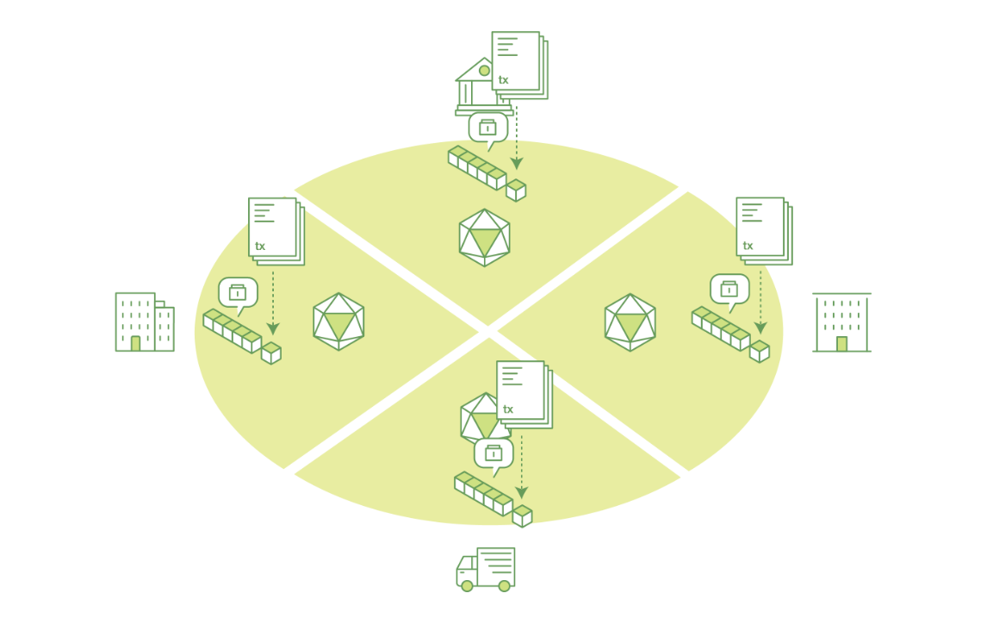
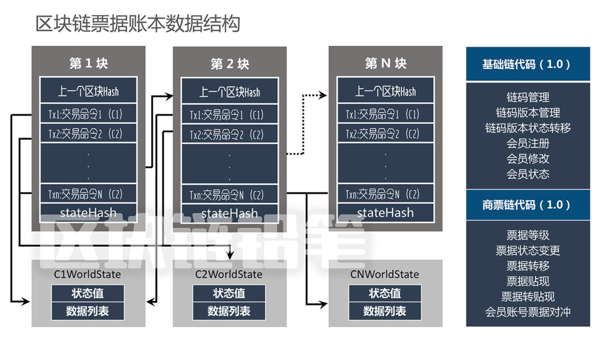
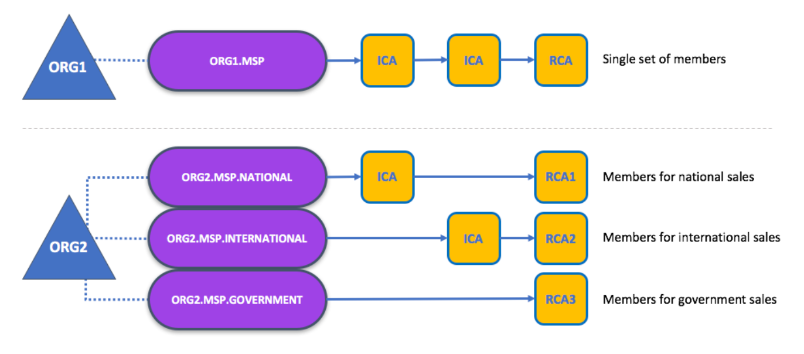
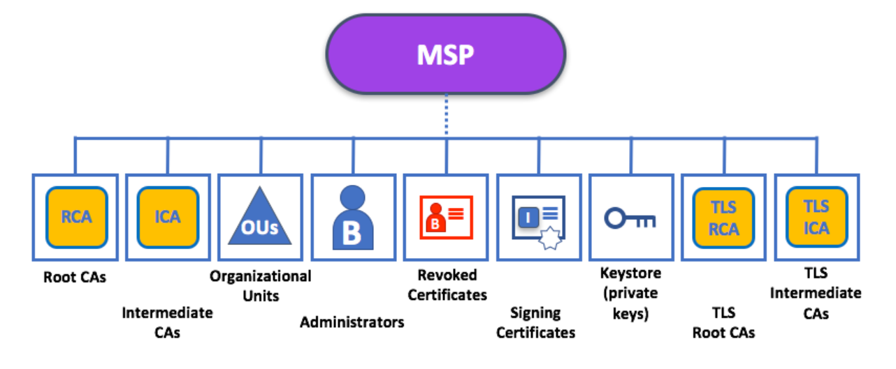
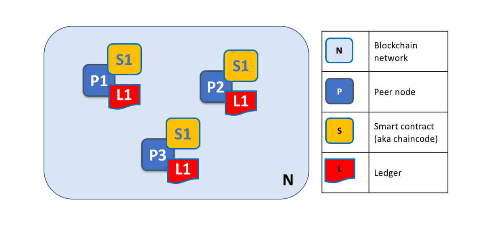
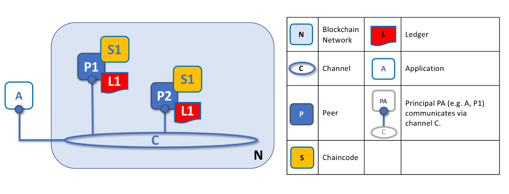
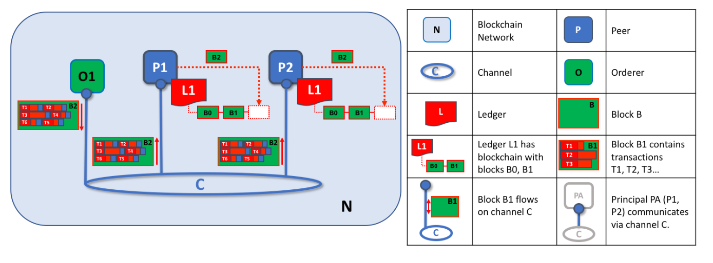

# Hyperledger Fabric Analysis

#### 分布式账本

区块链核心概念是分布式帐本，就像下面的图所示，同样的帐本（全量的交易数据，详见下节）在任意一台节点（不包括客户端）上都有。

#### 分布式账本的数据结构

它由多个区块构成了一个有时序的链表，而每个区块里含有多条交易trasaction（缩写为tx）构成的链表。上方有一个WorldState世界状态，这其实是为了提升性能用的。比如，key1共交易了10000次，为了获取它的当前状态值，需要正向执行这10000次交易，这就得不偿失了。如果这1万次交易里，每次新交易执行完，都同步更新一个数据库（在fabric里用的是levelDB），这样查询当前状态时，只需要查询该数据库即可。

#### 智能合约（chaincode）

举个例子说明一下核心智能合约的概念。

智能合约的概念。在传统中心化的系统中，例如支付宝用户A给B转账100元，那么假设起始A有100元B有0元，那么在支付宝系统内调用转账的函数可能是这样的一个流程，调用transfer(A,B,100)，而函数内可能会去读取用户A和B的账户余额，那么我们可以表达成input(A,B,100),read(A:100,B:0),write(A:0,B:100)，那么这个仅是在支付宝的系统内执行了便完成了，那如何形成一个合约呢？

就如A、B在签订一份合同，双方都要对合同进行签名认可，在程序中就等于，用户A在其本地执行transfer(A,B,100)得出input(A,B,100),read(A:100,B:0),write(A:0,B:100)并对其签名认证，用户B在其本地执行transfer(A,B,100)得出input(A,B,100),read(A:100,B:0),write(A:0,B:100)并对其签名认证，然后双方将结果发给对方，然后判断对方结果是否一致并对其签名进行校验无误后便认为合约达成将结果写入本地。通俗来说就是将一段核心代码抽出来，所有参与方都去执行该代码并对其结果进行签名认证比对，便称之为执行智能合约，而其中共有的代码便是**合约**。

*再说”背书策略“的概念。那么根据上面所言的共有代码在交易中是不是所有用户都要执行呢？比如说A、B用户转账，那么C、D用户显然就不需要规定其参与执行职能合约了，那么背书策略便是规定智能合约的结果需要哪些成员的签名背书才算交易成功。*

**fabric核心概念**

- chaincode：智能合约，上文已提到。每个chaincode可提供多个不同的调用命令。对外封装成一个SDK
- transaction：交易，每条指令都是一次交易。
- world state：对同一个key的多次交易形成的最终value，就是世界状态。
- endorse：背书。金融上的意义为：指持票人为将票据权利转让给他人或者将一定的票据权利授予他人行使，而在票据背面或者粘单上记载有关事项并签章的行为。通常我们引申为对某个事情负责。在我们的共识机制的投票环节里，背书意味着参与投票。
- endorsement policy：背书策略。由智能合约chaincode选择哪些peer节点参与到背书环节来。
- peer：存放区块链数据的结点，同时还有endorse（背书）和commit功能。
- channel：私有的子网络，事实上是为了隔离不同的应用，一个channel可含有一批chaincode。
- PKI：Public Key Infrastructure，一种遵循标准的利用公钥加密技术为电子商务的开展提供一套安全基础平台的技术和规范。
- MSP：Membership Service Provider，联盟链成员的证书管理，它定义了哪些RCA以及ICA在链里是可信任的，包括定义了channel上的合作者。
- org：orginazation，管理一系列合作企业的组织。

**下面是ORG与MSP关系的图解：**

ORG结构：

每个管理协作企业的ORG组织都可以拥有自己的MSP。如下图14所示，组织ORG1拥有的MSP叫ORG1.MSP，而组织ORG2业务复杂，所以维护了3个MSP。

MSP结构：

- RCA根证书
- ICA中间证书
- OU组织单位
- 管理员证书
- RCL吊销证书列表
- 结点上的具体证书
- 存储私钥的keystore
- TLS的根证书与中间证书

#### Fabric交易流程

***\*Fabric交易流程图如下所示：\****  

区块链最主要的特性之一是去中心化，没有了中心机构的集中处理，为了达成数据的一致性，就需要网络中全民参与管理，并以某种方法达成共识，所以区块链的交易流程也就是共识的过程。

Fabric交易流程图

***\*交易过程详细流程：\****  

1、应用程序客户端通过SDK调用证书服务（CA）服务，进行注册和登记，并获取身份证书；

2、应用程序客户端通过SDK向区块链网络发起一个交易提案（Proposal），交易提案把带有本次交易要调用的合约标识、合约方法和参数信息以及客户端签名等信息发送给背书（Endorser）节点。

3、背书（Endorser）节点收到交易提案（Proposal）后，验证签名并确定提交者是否有权执行操作，同时根据背书策略模拟执行**智能合约**，并将结果及其各自的CA证书签名发还给应用程序客户端。

4、应用程序客户端收到背书（Endorser）节点返回的信息后，判断提案结果是否一致，以及是否参照指定的背书策略执行，如果没有足够的背书，则中止处理；否则，应用程序客户端把数据打包到一起组成一个交易并签名，发送给Orderers。

5、Orderers对接收到的交易进行共识排序，然后按照区块生成策略，将一批交易打包到一起，生成新的区块，发送给提交（Committer）节点；

6、提交（Committer）节点收到区块后，会对区块中的每笔交易进行校验，检查交易依赖的输入输出是否符合当前区块链的状态，完成后将区块追加到本地的区块链，并修改世界状态。

**在Fabric的交易流程中，主要有几个关键节点参与，包括Peer节点、Orderer节点、CA节点及client端。**

- Peer节点

  

  该节点是参与交易的主体，可以说是代表每个参与到链上的成员，他负责储存完整的账本数据即区块链数据，负责共识环节中的执行智能合约，其中所有的Peer节点都维护完整的账本数据称之为Committer，而根据具体的业务划分背书策略时决定哪些Peer。

- Channel

  

  channel是一个逻辑概念，可以通过MSP隔离全网不同组织的参与者，如上图所示

  

- Orderer节点

  该节点负责收集交易请求进行排序并打包生产新的区块，主体功能便是对交易排序从而保证各Peer节点上的数据一致性，也包含了ACL进行访问控制。

- CA节点

  该节点负责对加入链内的所有节点进行授权认证，包括上层的client端，每一个节点都有其颁发的证书用于交易流程中的身份识别。

- client

  Fabric对于client端提供了SDK让开发人员可以更容易的对接到区块链内的交易环节，交易的发起便是通过SDK进行。

#### 深入了解Hyperledger Fabric

**BlockchainNetwork**

MSP来管理身份时，如P1和P2由ORG1.MSP管理，而P3和P4的证书则由ORG2.MSP管理，他们共同使用一个channel，则如下图所示：

**上述Fabric交易流程为模块设计简单并抽象理解交易执行流程，下面，等我们深入去了解Fabric详细的交易流程吧。**

***深入了解 Fabric交易流程***

*中心化的设计，必然需要通过投票（多数大于少数）来维持数据一致性，而任何投票都必须经历以下三个过程：*

1. 有一方先提出议案proposal，该议案有对应的一批投票者需要对该结果背书，这些投票者依据各自的习惯投票，并将结果反馈；
2. 统计投票结果，若获得多数同意，才能进行下一步；
3. 将获得多数同意的议案记录下来，且公之于众。

*而这三步fabric当然也少不了，当然它的称法就有所不同，其对应的三步如下：*

1. 由client上的CLI或者SDK进行proposal议案的提出。client会依据智能合约chaincode根据背书策略endorse policy决定把proposal发往哪些背书的peer节点，而peer节点进行投票，client汇总各背书节点的结果；
2. client将获得多数同意的议案连同各peer的背书（包括其投票结果以及背书签名）交给orderring service，而orderer会汇总各client递交过来的trasaction交易，排序、打包。
3. orderer将交易打包成区块block，然后通知所有commit peer，各peer各自验证结果，最后将区块block记录到自己的ledger账本中。

**我们看一个具体的例子，若channel上有三个peer背书者，client提交流程如下图所示：**

1. 首先，client发起一个transaction交易，含有*<clientID, chaincodeID, txPayLoad, timestamp, clientSig>*等信息，指明了3W要素：消息是谁who在什么时间when发送了什么what。该消息根据chaincode中的背书策略，发向EP1、EP2、EP3这三个peer节点。
2. 这三个peer节点模拟执行智能合约，并将结果及其各自的CA证书签名发还client。client收集到足够数量的结果后再进行下一步。
3. client将含背书结果的tx交易发向ordering service。
4. ordering service将打包好的block交给committing peer CP1以及EP1、EP2、EP3这三个背书者，背书者此时会校验结果并写入世界状态以及账本中。同时，client由于订阅了消息，也会收到通知。

上文提到的*Ordering service*我们再来个详解吧，详细分为三个阶段

##### proposal提案阶段

可以看到，A1发出的<T1, P>，收到了<T1, R1, E1>和<T1, R2, E2>两个结果。

##### package打包阶段

O1在一个channel上会收到许多T交易，它会将T排序，在达到block的最大大小（一般应配1M以下，否则性能下降严重，kafka擅长处理小点的消息）或者达到超时时间后，打成区块P2。

##### 验证阶段

O1将含有多条交易T打成区块的B2发往各peer节点，而P1和P2将B2加入各自的L账本中。

目前想要接入区块链的成本仍然是很高的，即便Fabric项目大部分功能都无法通过可视化的配置，需要了解更多的底层细节才能正确搭建环境及配置。

**在认识主体交易流程后，我们来看看Fabric里面的核心基础服务如何支撑区块链的调用运行的。**

#### 核心基础服务

对Fabric的主体模块及流程有一定认识后我们在继续深究里面的细节功能，为了让整个框架能运作起来当然需要用到更多的技术手段，这里主要讲几个相对核心的功能点。

- Gossip Protocol

回顾上述的交易流程图中，Orderer将交易数据排序打包后分发给各个Peer节点，若假设有成百上千甚至更多的Peer节点都由Orderer节点进行分发那么首先单点的压力是否能承受，其次如果出现失败的情况又该如何同步等问题。在Fabric的实现当中，采用的是让Peer节点之间相互同步而非Orderer节点来分发消息，每个Peer节点都会维护其他Peer节点的信息，随机的与部分其他Peer节点进行通信互换区块信息，传输时利用Peer-to-Peer的技术去加快数据的传输，而Orderer节点仅是将打包好的区块发送至特定的Leader Peer（可手动指定也可由Orderer自行选取），然后Peer节点之间在通过Gossip协议相互交换数据达到最终一致性。

- Eventhub

那么根据上面描述的Gossip协议，可见每个Peer节点写入区块的时间可能是不一致的，那么client端进行业务逻辑判断（如事务逻辑）如何获知特定交易数据是否已经写入Peer节点内呢？实际上每个Peer都会和client端保持一个Eventhub的连接，在Peer节点完成交易后，如将区块写入账本后便会发送消息通知各个client，但是也要注意，回调总是不可信的，存在消息丢失的可能性，Fabric也并没有保证消息的最终到达。

- Read-Write Set

在Peer节点将一个区块写入账本前，如上所述会进行背书策略的校验，以防止恶意节点的入侵，达到有权重划分，可实名制交易的联盟链。除去验证各节点签名验证，当然还要比对个节点输出的结果是否一致，那如何去衡量结果是否一致呢？这里提出了读写集合的概念，一段程序我们化做为IO，如果使用相同Input得出一致的Output，那么我们便可以认同在这一特定情况下函数性质是相同的。在这里我们并不关心Input，只要写入/修改的数据一致便可认为达成了共识，所以Write Set是用于保存最终需要写入/修改的数据集，这个是用来比对各节点的结果集是否一致，而Read Set中存着各节点执行合约中读取了哪些数据，并会把这个数据的当前版本记录在Read Set中，在Peer节点写入区块前也会校验Read Set中读取的数据版本是否和当前数据环境中的版本一致，以防止交易并发带来的错乱。

#### 认证体系

刚接触区块链的同学可能会有一个概念，区块链应该保证公平公正公开，所以形成了“公有链”的一个概念，例如比特币，全员可参与，对所有人透明。但是区块链并不仅局限于“公有链”，对于大多数业务场景来说，应该属于“联盟链”，即由特定成员参与、有权重分配的业务，例如银行间的对账环节，A、B、C银行互相的交易中，A、B银行间的交易当然不愿意透露给C银行，而A、B、C银行的所有交易或许都要上报给央行，可见此处“公有链”是不可取的。那如何去保证公平公正公开呢？首先代码必须对成员开源，所有服务可由自身搭建，利益相关成员共同审核“智能合约”，全员共识的背书策略，相互授权或由可信第三方认证中心授权。那么最基础的一道认证体系便显得尤为重要了，我们在来看看Fabric是如何去实现他的认证体系的。

首先有几个概念需要明确，Fabric的CA认证中心是基于PKI体系打造的，相关资料可参考如下。

- [PKI(Public Key Infrastructure)](https://yq.aliyun.com/go/articleRenderRedirect?url=https%3A%2F%2Fen.wikipedia.org%2Fwiki%2FPublic_key_infrastructure)
- [X.509 证书](https://yq.aliyun.com/go/articleRenderRedirect?url=https%3A%2F%2Fen.wikipedia.org%2Fwiki%2FX.509)

**Membership Service Providers(MSP)**
在划分成员结构的时候Fabric用MSP来定义一个成员，在最佳实例推荐中，一个企业或者机构可以是一个单独的MSP，例如上述说到的供应链的案例，由例图来说明，核心企业便是一个MSP，银行和供应商各代表一个MSP，那么在一个MSP下可以有多个Peer节点，而不同的授权便有不同的功能，MSP具体应用场景主要如下。

- 在部署智能合约或者初始化时需要拥有对应CA赋权的证书才可执行（默认为PeerAdmin用户）。
- 为新节点或用户注册证书时，需要CA对该操作证书赋予权限（一般为Admin用户）。
- 在背书策略中可通过MSP来代表背书成员，可设定单个Peer节点代表其MSP达成协议（也可以要求全部Peer节点通过才达成协议）。
- 在跨MSP间的Peer节点通信，先通过各MSP内指定的Anchor Peer收集MSP内的Peer列表，然后通过各MSP下的Anchor Peer交互其Peer列表，将其他MSP下的Peer列表同步到内部Peer后，便通过Gossip协议Peer节点间随机通信。
- 每个MSP都有自己独立的CA节点，为其提供所有的证书需求，各MSP共享其CA节点的ROOT证书达到互相认证。
- 匿名交易。在一笔交易中，包含着每一个参与背书的用户证书，这可以认为是公开实名制的交易，所有链内成员都可以看见每一笔交易是由谁参与的，但是如果我们希望匿名交易该如何实现呢？在Fabric 0.6版本内有Ecert和Tcert的概念，Ecert即为用户的证书，而Tcert则是用于匿名交易，用户可以通过向CA申请一批Tcert用于交易，而该Tcert不包含用户的信息，当需要验证查验信息时可通过CA来认证该用户的身份。（此功能在1.0版本尚未实现）
- Revoke，废除证书。在PKI体系中，其最大的优势便是Off line的，即在证书颁发后，不需要CA节点的存在也可以在本地进行认证，而遇到很大的问题是类似于废除证书时如果希望能即是将废除证书的消息通知到各个节点，目前的做法是需要CA节点保持在线并与各节点保持通信。（获取Tcert也需要CA节点在线）

以上是初步了解HyperledgerFabric框架的内容，更多的留在往后的开发过程中边学边做吧。 