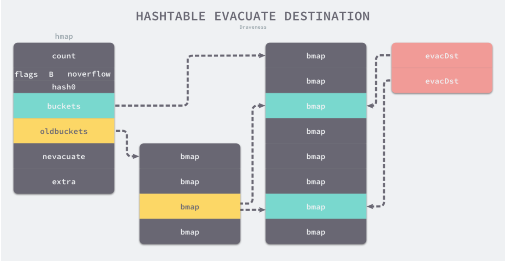

### map基础结构

```go
// A header for a Go map.
type hmap struct {
    
    buckets    unsafe.Pointer // array of 2^B Buckets. may be nil if count==0.
	oldbuckets unsafe.Pointer // previous bucket array of half the size, non-nil only when growing
    extra *mapextra // optional fields
   
    
    
    
    //下面参数为一些map内部操作所需的size参数，此步不需要入侵了解。
	// Make sure this stays in sync with the compiler's definition.
	count     int // # live cells == size of map.  Must be first (used by len() builtin)
	flags     uint8
	B         uint8  // log_2 of # of buckets (can hold up to loadFactor * 2^B items)
	noverflow uint16 // approximate number of overflow buckets; see incrnoverflow for details
	hash0     uint32 // hash seed
	nevacuate  uintptr        // progress counter for evacuation (buckets less than this have been evacuated)
	
}
```


其实map就是上图的结构：

* **buckets** : 一个大小为2^B大小的桶，里面存放bmap数组
* **bmap**：一种有8个格子的桶（一定只有8个格子），每个格子存放一对key-value
* **overflow**：bmap的一个链表指针，用于连接下一个bmap（溢出桶）
* **oldbuckets**：hmap用于存放老数据（用于扩容时）
* **mapextra** ：用于存放非指针数据（用于优化存储和访问），内部的overflow和oldoverflow实际还是bmap的数组。


### Map初始化

```Go
func makemap(t *maptype, hint int, h *hmap) *hmap {
    // 计算哈希占用的内存是否溢出或者超出能分配的最大值
	mem, overflow := math.MulUintptr(uintptr(hint), t.bucket.size)
	if overflow || mem > maxAlloc {
		hint = 0
	}
	if h == nil {
		h = new(hmap)
	}
    //调用 fastrand 获取一个随机的哈希种子
	h.hash0 = fastrand()
   //根据传入的 hint 计算出需要的最小需要的桶的数量  2的B次方个桶
	B := uint8(0)
	for overLoadFactor(hint, B) {
		B++
	}
	h.B = B

	if h.B != 0 {
		var nextOverflow *bmap
        //使用 runtime.makeBucketArray 创建用于保存桶的数组
		h.buckets, nextOverflow = makeBucketArray(t, h.B, nil)
		if nextOverflow != nil {
			h.extra = new(mapextra)
			h.extra.nextOverflow = nextOverflow
		}
	}
	return h
}
```


**所有的理论最简单的说明就是举例子了，来让我们1+1=2吧**


### Get

#### Map-Get


1. **计算出key的hash**

2. **根据最后的“B”位来确定在哪个桶（如果B为4，B为4，就有16个桶，看4位，即：0101用十进制表示为5，所以在5号桶）**

3. **找到桶子后，根据key的前8位快速确定是在哪个格子（额外说明一下，在bmap中存放了每个key对应的tophash，是key的前8位）**

4. **最终还是需要比对key完整的hash是否匹配，如果匹配则获取对应value**

5. **如果都没有找到，就去下一个overflow找**

   

*注：第二步的如果B为2，即只看后两位，01:即在一号桶。*


源码重点分析：(不为源码全部内容，只选取部分重点流程代码分析)

```go
func mapaccess1(t *maptype, h *hmap, key unsafe.Pointer) unsafe.Pointer {
	...
    ...
    ...
    //计算key的hash值
	hash := alg.hash(key, uintptr(h.hash0))
    //通过B计算桶的位置
	m := bucketMask(h.B)
	b := (*bmap)(add(h.buckets, (hash&m)*uintptr(t.bucketsize)))
	if c := h.oldbuckets; c != nil {
		if !h.sameSizeGrow() {
			// There used to be half as many buckets; mask down one more power of two.
			m >>= 1
		}
		oldb := (*bmap)(add(c, (hash&m)*uintptr(t.bucketsize)))
		if !evacuated(oldb) {
			b = oldb
		}
	}
    //取出key的前8位作为tophash
	top := tophash(hash)
bucketloop:
	for ; b != nil; b = b.overflow(t) {
        //循环查找当前桶的格子，找不到调到下一个溢出栈
		for i := uintptr(0); i < bucketCnt; i++ {
            //对比tophash是否一致
			if b.tophash[i] != top {
				if b.tophash[i] == emptyRest {
					break bucketloop
				}
				continue
			}
			k := add(unsafe.Pointer(b), dataOffset+i*uintptr(t.keysize))
			if t.indirectkey() {
				k = *((*unsafe.Pointer)(k))
			}
            //对比hash是否一致
			if alg.equal(key, k) {
				e := add(unsafe.Pointer(b), dataOffset+bucketCnt*uintptr(t.keysize)+i*uintptr(t.elemsize))
				if t.indirectelem() {
					e = *((*unsafe.Pointer)(e))
				}
				return e
			}
		}
	}
	return unsafe.Pointer(&zeroVal[0])
}
```


### Put

#### Map-Put

###### 新的key-value存入


1. **通过key的后“B”位确定是哪一个桶**
2. **通过key的前8位快速确定是否已经存在**
3. **最终确定存放位置，如果8个格子已经满了，没地方放了，那么就重新创建一个bmap作为溢出桶连接在overflow**


###### 旧的key-value覆盖

*其中 `inserti` 表示目标元素的在桶中的索引，`insertk` 和 `val` 分别表示键值对的地址*

```go
var inserti *uint8
	var insertk unsafe.Pointer
	var val unsafe.Pointer
//遍历比较桶中存储的 `tophash` 和键的哈希，如果找到了相同结果就会获取目标位置的地址并返回
bucketloop:
	for {
		for i := uintptr(0); i < bucketCnt; i++ {
			if b.tophash[i] != top {
				if isEmpty(b.tophash[i]) && inserti == nil {
					inserti = &b.tophash[i]
					insertk = add(unsafe.Pointer(b), dataOffset+i*uintptr(t.keysize))
					val = add(unsafe.Pointer(b), dataOffset+bucketCnt*uintptr(t.keysize)+i*uintptr(t.valuesize))
				}
				if b.tophash[i] == emptyRest {
					break bucketloop
				}
				continue
			}
			k := add(unsafe.Pointer(b), dataOffset+i*uintptr(t.keysize))
            //获得目标地址之后会直接通过算术计算进行寻址获得键值对 `k` 和 `val
			if !alg.equal(key, k) {
				continue
			}
			val = add(unsafe.Pointer(b), dataOffset+bucketCnt*uintptr(t.keysize)+i*uintptr(t.valuesize))
			goto done
		}
		ovf := b.overflow(t)
		if ovf == nil {
			break
		}
		b = ovf
	}
```


### Map扩容

######  扩容的方式有以下两种：

1. 相同容量扩容
2. 翻倍容量扩容
   有两种情况会出现，第一种出现的情况是：因为map不断的put和delete，出现了很多空格，这些空格会导致bmap很长，但是中间有很多空的地方，扫描时间变长。所以第一种扩容实际是一种整理，将数据整理到前面一起。第二种呢：就是真的不够用了，扩容两倍。

###### 扩容条件：

*装载因子*

如果你看过Java的HashMap实现，就知道有个装载因子，同样的在golang中也有，但是不一样哦。装载因子的定义是这个样子：

```
loadFactor := count / (2^B)
```


其中count为map中元素的个数，B就是之前个那个“B”，也就是（map中元素的个数）/（map当前桶的个数）

###### 扩容条件1

装载因子 > 6.5（这个值是源码中写的）
*其实意思就是，桶只有那么几个，但是元素很多，证明有很多溢出桶的存在（可以想成链表拉的太长了），那么扫描速度会很慢，就要扩容。*

###### 扩容条件2

overflow 的 bucket 数量过多：当 B 小于 15，如果 overflow 的 bucket 数量超过 2^B ；当 B >= 15，如果 overflow 的 bucket 数量超过 2^15 。源码里面有个判断函数：tooManyOverflowBuckets，有兴趣的可以一看

*其实意思就是，可能有一个单独的一条链拉的很长，溢出桶太多了，说白了就是，加入的key不巧，后B位都一样，一直落在同一个桶里面，这个桶一直放，虽然装载因子不高，但是扫描速度就很慢。*

###### 扩容条件3

当前正在扩容


###### **相同容量扩容**


*相同容量的扩容，实际上就是一种整理，将分散的数据集合到一起，提高扫描效率。*


###### **翻倍容量扩容**


*双倍扩容同时会带来元素的整理，如果有两个key后三位分别是001和101，当B=2时，只有4个桶，只看最后两位，这两个key后两位都是01所以在一个桶里面；扩容之后B=3，就会有8个桶，看后面三位，于是它们就分到了不同的桶里面。*


###### 图解[`runtime.evacuate`](https://github.com/golang/go/blob/36f30ba289e31df033d100b2adb4eaf557f05a34/src/runtime/map.go#L1128-L1240)流程：



- 扩容不是一次性完成的，还记的我们hmap一开始有一个oldbuckets吗？是先将老数据存到这个里面
- 每次搬运1到2个bucket，当插入或修改、删除key触发
- 扩容之后肯定会影响到get和put，遍历的时候肯定会先从oldbuckets拿，put肯定也要考虑是否要放到新产生的桶里面去


# golang 中的map为什么说是非线程安全的

golang的map 跟hash map 是一样的，但是go的分配过程又有自己独特的方式。可找下golang map 原理的文章看下。但是为什么说map 是非线程安全的呢？

因为hash map 的内存是按照2的倍数开辟的，当前面开辟的内存不够的时候，会新开辟一段内存，将原来内存的数据转移到新的内存块中，这个过程是没有加锁的，如果这个时候同时有个读的线程过来获取这块内存数据，就会出现安全问题。

所以多个goroutine同时操作map的时候可能会出现concurrent map writes 的问题，自己实现一个加好读写锁的map结构，建议直接用golang 的sync.Map。性能好，同时简单易用。


##### 写在最后：

###### JavaMap与GolangMap对比:

我们常见的map如java中的map是直接拿数组，数组中直接对应出了key-value，而在golang中，做了多加中间一层，buckets；java中如果key的哈希相同会采用链表的方式连接下去，当达到一定程度会转换红黑树，golang中直接类似链表连接下去，只不过连接下去的是buckets。

###### Go的Map线程不安全性，用锁实现线程安全操作：

```go

type SafeMap struct {
	data  map[string]string
	*sync.RWMutex
}

```

Golang Map 个人问题：

map Buckets 最大size是 2的15次方 
问题，既然hmap是用链表相连，为什么每次遍历map的时候顺序不一直在，是通过每次产生的随机数来决定元素的顺序？


###### 下一篇讲解Golang 1.9推出的sync.Map