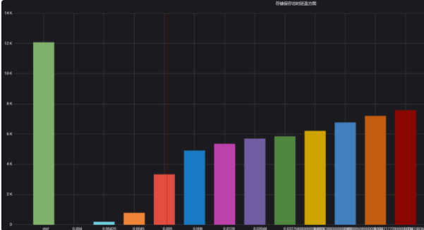

# Prometheus Apply

**1. Prometheus Metrics 有四种基本的 type：**

- Counter: 只增不减的单变量
- Gauge：可增可减的单变量
- Histogram：多桶统计的多变量
- Summary：聚合统计的多变量

此外，Prometheus Metrics 中有一种将样本数据以标签（Label）为维度作切分的数据类型，称为向量(Vector)。四种基本类型也都有其 Vector 类型：

- CounterVec
- GaugeVec
- HistogramVec
- SummaryVec

**Vector 相当于一组同名同类型的 Metrics，以 Label 做区分。**Label 可以有多个，Prometheus 实际会为每个 Label 组合创建一个 Metric。Vector 类型记录数据时需先打 Label 才能调用 Metrics 的方法记录数据。

如对于 HTTP 请求延迟这一指标，由于 HTTP 请求可在多个地域的服务器处理，且具有不同的方法，于是，可定义名为 `http_request_latency_seconds` 的 SummaryVec，标签有`region`和`method`，以此表示不同地域服务器的不同请求方法的请求延迟。

以下将对每个类型做详细的介绍。


**2.1 Counter**

- 定义：是单调递增的计数器，重启时重置为0，其余时候只能增加。
- 方法： type Counter interface {   Metric   Collector    // 自增1   Inc()   // 把给定值加入到计数器中. 若值小于 0 会 panic   Add(float64) }
- 常测量对象：
  - 请求的数量
  - 任务完成的数量
  - 函数调用次数
  - 错误发生次数
  - ..

**2.2 Gauge**

- 定义：表示一个可增可减的数字变量，初值为0
- 方法： type Gauge interface {   Metric   Collector   Set(float64)    // 直接设置成给定值   Inc()   // 自增1   Dec()   // 自减1   Add(float64)     // 增加给定值，可为负   Sub(float64)    // 减少给定值，可为负   // SetToCurrentTime 将 Gauge 设置成当前的 Unix 时间戳   SetToCurrentTime() }
- 常测量对象：
  - 温度
  - 内存用量
  - 并发请求数
  - ...

**2.3 Histogram**

- 定义：Histogram 会对观测数据取样，然后将观测数据放入有数值上界的桶中，并记录各桶中数据的个数，所有数据的个数和数据数值总和。
- 方法： type Histogram interface {   Metric   Collector    // Observe 将一个观测到的样本数据加入 Histogram 中，并更新相关信息   Observe(float64) }
- 常测量对象：
  - 请求时延
  - 回复长度
  - ...各种有样本数据
- 具体实现：Histogram 会根据观测的样本生成如下数据： inf 表无穷值，a1,a2,...是单调递增的数值序列。
  - [basename]_count: 数据的个数，类型为 counter
  - [basename]_sum: 数据的加和，类型为 counter
  - [basename]_bucket{le=a1}: 处于[-inf,a1]的数值个数
  - [basename]_bucket{le=a2}: 处于[-inf,a2]的数值个数
  - ...
  - [basename]_bucket{le=<+inf>}：处于[-inf,+inf]的数值个数，prometheus默认额外生成，无需用户定义
- Histogram 可以计算样本数据的百分位数，其计算原理为：通过找特定的百分位数值在哪个桶中，然后再通过插值得到结果。比如目前有两个桶，分别存储了[-inf, 1]和[-inf, 2]的数据。然后现在有20%的数据在[-inf, 1]的桶，100%的数据在[-inf, 2]的桶。那么，50%分位数就应该在[1, 2]的区间中，且处于(50%-20%) / (100%-20%) = 30% / 80% = 37.5% 的位置处。Prometheus计算时假设区间中数据是均匀分布，因此直接通过线性插值可以得到 (2-1)*3/8+1 = 1.375.

**2.4 Summary**

- 定义：Summary 与 Histogram 类似，会对观测数据进行取样，得到数据的个数和总和。此外，还会取一个滑动窗口，计算窗口内样本数据的分位数。
- 方法： type Summary interface {   Metric   Collector    // Observe 将一个观测到的样本数据加入 Summary 中，并更新相关信息   Observe(float64) }
- 常测量对象：
  - 请求时延
  - 回复长度
  - ...各种有样本数据
- 具体实现：Summary 完全是在client端聚合数据，每次调用 obeserve 会计算出如下数据：
  - [basename]_count: 数据的个数，类型为 counter
  - [basename]_sum: 数据的加和，类型为 counter
  - [basename]{quantile=0.5}: 滑动窗口内 50% 分位数值
  - [basename]{quantile=0.9}: 滑动窗口内 90% 分位数值
  - [basename]{quantile=0.99}: 滑动窗口内 99% 分位数值
  - ...

实际分位数值可根据需求制定，且是对每一个 Label 组合做聚合。

**2.5 Histogram 和 Summary 简单对比**

可以看出，Histogram 和 Summary 类型测量的对象是比较接近的，但根据其实现方式和其本身的特点，在性能耗费、适用场景等方面具有一定差别，本文总结如下：

| 类型             | Histogram                                              | Summary                                                      |
| :--------------- | :----------------------------------------------------- | :----------------------------------------------------------- |
| 客户端性能耗费   | 较低，只需增加counter                                  | 较高，需聚合计算百分位数                                     |
| 服务端性能耗费   | 较高，需要聚合计算                                     | 较低，无需再聚合计算                                         |
| 时间序列数据     | 每个bucket一个                                         | 每个百分位数一个                                             |
| 百分位数计算误差 | 依赖于桶区间粒度和数据分布，受限于桶的数量             | 受限于百分位数值本身                                         |
| 聚合             | 查询时可以灵活聚合数据                                 | 查询时不建议做聚合，百分位数无法做聚合，只能做均值和加和的聚合 |
| 数据的时间范围   | 可在查询时灵活定制                                     | 活动窗口内，窗口大小在声明 Metrics 后不可更改，即查询时也不可更改 |
| 适用场景         | 客户端监控，组件在系统中较多，不太关心精确的百分位数值 | 服务端监控，组件在系统中唯一或只有个位数，需要知道较准确的百分位数值(如性能优化场景) |

03

**Metrics 设计的最佳实践**

**3.1 如何确定需要测量的对象**

在具体设计 Metrics 之前，首先需要明确需要测量的对象。需要测量的对象应该依据具体的问题背景、需求和需监控的系统本身来确定。

### 思路1：从需求出发

Google 针对大量分布式监控的经验总结出四个监控的黄金指标，这四个指标对于一般性的监控测量对象都具有较好的参考意义。这四个指标分别为：

- 延迟：服务请求的时间。
- 通讯量：监控当前系统的流量，用于衡量服务的容量需求。
- 错误：监控当前系统所有发生的错误请求，衡量当前系统错误发生的速率。
- 饱和度：衡量当前服务的饱和度。主要强调最能影响服务状态的受限制的资源。例如，如果系统主要受内存影响，那就主要关注系统的内存状态。

而笔者认为，以上四种指标，其实是为了满足四个监控需求：

- 反映用户体验，衡量系统核心性能。如：在线系统的时延，作业计算系统的作业完成时间等。
- 反映系统的服务量。如：请求数，发出和接收的网络包大小等。
- 帮助发现和定位故障和问题。如：错误计数、调用失败率等。
- 反映系统的饱和度和负载。如：系统占用的内存、作业队列的长度等。

除了以上常规需求，还可根据具体的问题场景，为了排除和发现以前出现过或可能出现的问题，确定相应的测量对象。比如，系统需要经常调用的一个库的接口可能耗时较长，或偶有失败，可制定 Metrics 以测量这个接口的时延和失败数。

### 思路2：从需监控的系统出发

另一方面，为了满足相应的需求，不同系统需要观测的测量对象也是不同的。在 官方文档 的最佳实践中，将需要监控的应用分为了三类：

- 线上服务系统（Online-serving systems）：需对请求做即时的响应，请求发起者会等待响应。如 web 服务器。
- 线下计算系统（Offline processing）：请求发起者不会等待响应，请求的作业通常会耗时较长。如批处理计算框架 Spark 等。
- 批处理作业（Batch jobs）：这类应用通常为一次性的，不会一直运行，运行完成后便会结束运行。如数据分析的 MapReduce 作业。

对于每一类应用其通常情况下测量的对象是不太一样的。其总结如下：

- 线上服务系统：主要有请求、出错的数量，请求的时延等。
- 线下计算系统：最后开始处理作业的时间，目前正在处理作业的数量，发出了多少 items， 作业队列的长度等。
- 批处理作业：最后成功执行的时刻，每个主要 stage 的执行时间，总的耗时，处理的记录数量等。

除了系统本身，有时还需监控子系统：

- 使用的库（Libraries）: 调用次数，成功数，出错数，调用的时延。
- 日志（Logging）：计数每一条写入的日志，从而可找到每条日志发生的频率和时间。
- Failures: 错误计数。
- 线程池：排队的请求数，正在使用的线程数，总线程数，耗时，正在处理的任务数等。
- 缓存：请求数，命中数，总时延等。
- ...

最后的测量对象的确定应结合以上两点思路确定。

**3.2 如何选用 Vector**

选用 Vec 的原则：

- 数据类型类似但资源类型、收集地点等不同
- Vec 内数据单位统一

例子：

- 不同资源对象的请求延迟
- 不同地域服务器的请求延迟
- 不同 http 请求错误的计数
- ...

此外，官方文档 中建议，对于一个资源对象的不同操作，如 Read/Write、Send/Receive， 应采用不同的 Metric 去记录，而不要放在一个 Metric 里。原因是监控时一般不会对这两者做聚合，而是分别去观测。

不过对于 request 的测量，通常是以 Label 做区分不同的 action。

**3.3 如何确定 Label**

根据3.2，常见 Label 的选择有：

- resource
- region
- type
- ...

确定 Label 的一个重要原则是：同一维度 Label 的数据是可平均和可加和的，也即单位要统一。如风扇的风速和电压就不能放在一个 Label 里。

此外，不建议下列做法：

```javascript
my_metric{label=a} 1
my_metric{label=b} 6
my_metric{label=total} 7
```

即在 Label 中同时统计了分和总的数据，建议采用 PromQL 在服务器端聚合得到总和的结果。或者用另外的 Metric 去测量总的数据。

**3.4 如何命名 Metrics 和 Label**

好的命名能够见名知义，因此命名也是良好设计的一环。

Metric 的命名：

- 需要符合 pattern: [a-zA-Z*:][a-zA-Z0-9*:]*
- 应该包含一个单词作为前缀，表明这个 Metric 所属的域。如：
  - prometheus_notifications_total
  - process_cpu_seconds_total
  - ipamd_request_latency
- 应该包含一个单位的单位作为后缀，表明这个 Metric 的单位。如：
  - http_request_duration_seconds
  - node_memory_usage_bytes
  - http_requests_total (for a unit-less accumulating count)
- 逻辑上与被测量的变量含义相同。
- 尽量使用基本单位，如 seconds，bytes。而不是 Milliseconds, megabytes。

Label 的命名：

- 依据选择的维度命名，如：
  - region: shenzhen/guangzhou/beijing
  - owner: user1/user2/user3
  - stage: extract/transform/load

**3.5 如何设计适宜的 Buckets**

根据前述 histogram 的统计原理可知，适宜的 buckets 能使 histogram 的百分位数计算更加准确。

理想情况下，桶会使得数据分布呈阶梯状，即各桶区间内数据个数大致相同。如图1所示，是本人在实际场景下配置的buckets 数据直方图，y 轴为 buckets 内的数据个数，x 轴是各 buckets，可以看出其近似成阶梯状。这种情况下，当前桶个数下对数据的分辨率最大，各百分位数计算的准确率较高。



**图1 较为理想的桶数据分布**

而根据笔者实践经验，为了达成以上目标，buckets 的设计可遵从如下经验：

- 需要知道数据的大致分布，若事先不知道可先用默认桶 （{.005, .01, .025, .05, .1, .25, .5, 1, 2.5, 5, 10}）或 2 倍数桶（{1,2,4,8...}）观察数据分布再调整 buckets。
- 数据分布较密处桶间隔制定的较窄一些，分布稀疏处可制定的较宽一些。
- 对于多数时延数据，一般具有长尾的特性，较适宜用指数形式的桶（ExponentialBuckets）。
- 初始桶上界一般覆盖10%左右的数据，若不关注头部数据也可以让初始上界更大一些。
- 若为了更准确计算特定百分位数，如90%，可在90%的数据处加密分布桶，即减少桶的间隔。


## 可视化 Grafana

1. 安装Grafana

```shell
$ wget https://dl.grafana.com/oss/release/grafana-6.5.1-1.x86_64.rpm
$ sudo yum localinstall grafana-6.5.1-1.x86_64.rpm
```

使用ansible role安装：[https://galaxy.ansible.com/list#roles/3563](https://links.jianshu.com/go?to=https%3A%2F%2Fgalaxy.ansible.com%2Flist%23roles%2F3563)
 使用Docker镜像安装：[https://hub.docker.com/search/?q=grafana](https://links.jianshu.com/go?to=https%3A%2F%2Fhub.docker.com%2Fsearch%2F%3Fq%3Dgrafana)

2. 启动与配置Grafana
    配置文件位于`/etc/grafana/grafana.ini`

```shell
$ systemctl start grafana-server
```

3. 浏览器访问[http://localhost:3000](https://links.jianshu.com/go?to=http%3A%2F%2Flocalhost%3A3000)，默认用户名和密码为admin和admin。
    Grafana仪表盘实例查看地址：[https://grafana.com/grafana/dashboards](https://links.jianshu.com/go?to=https%3A%2F%2Fgrafana.com%2Fgrafana%2Fdashboards)


## Prometheus配置Alertmanager

1. 在prometheus.yml配置中设置alerting模块。

```shell
alerting:
  alertmanagers:
  - static_configs:
    -targets:
      - alertmanager:9093
```

2. 监控Alertmanager
    Alertmanager服务暴露了自身的相关指标，创建一个Prometheus Job就可以监控Alertmanager

```shell
- job_name: 'alertmanager'
  static_configs:
    - targets: ['localhost:9093']
```

3. 添加警报规则
    与记录规则一样，警报规则在Prometheus服务器配置中加载的规则文件内也使用Yaml语句定义。
    在prometheus.yml配置文件中的rule_files块中添加文件rules/node_alerts.yml
    在rules目录下创建文件node_alerts.yml来保存节点报警规则。

```shell
$ cat > rules/node_alerts.yml <<EOF
groups:
- name: node_alerts
  rules:
  - alert: HighNodeCPU
    expr: instance:node_cpu:avg_rate5m > 80
    for: 60m
    labels:
      severity: warning
    annotations:
      summary: High Node CPU for 1 hour
      console: You might want to check the Node Dashboard at http://grafana.example.com/dashboard/db/node-dashboard
EOF
```

alert：规则名
 expr：触发规则
 for：控制在触发警报之前测试表达式必须为true的时长
 labels与annotations：装饰警报

警报有三种状态：
 Inactive：警报未激活
 Pending：警报已满足测试表达式条件，但仍在等待for子句中指定的持续时长
 Firing：警报（如果没有设置for，则一旦触发条件，立刻Firing）

Pending、Firing状态下的警报可以在Prometheus的指标中查看到ALERTS。
 新的警报与模板示例


```shell
groups:
- name: node_alerts
  rules:
  - alert: DiskWillFillIn4Hours
    expr: predict_linear(node_fileystem_size_bytes{mountpoing="/"}[1h], 4*3600) < 0
    for: 5m
    labels:
      severity: critical
    annotations:
      summary: Disk on {{ $labels.instance }} will fill in approximately 4 hours.
  - alert: InstanceDown
    expr: up{job="node"} == 0
    for: 10m
    labels:
      severity: critical
    annotations:
      summary: Host {{ $labels.instance }} of {{ $labels.job }} is down!
  - alert: NodeServiceDown
    expr: node_systemd_unit_state{state="active"} != 1
    for: 60s
    labels:
      severity: critical
    annotations:
      summary: Service {{$labels.name}} on {{ $labels.instance }} is no longer active!
      description: Service Down
  - alert: InstanceGone
    expr: absent(up{job="node"})
    for: 10s
    labels:
      severity: critical
    annotations:
      summary: Host {{ $labels.instance }} is no logger reporting!
      description: 'OMG Where are my instances'
- name: prometheus_alerts
  rules:
  - alert: PrometheusConfigReloadFailed
    expr: prometheus_config_last_reload_successful == 0
    for: 10m
    labels:
      severity: warning
    annotations:
      description: Reloading Prometheus configuration has failed on {{ $lables.instance }}.
  - alert: PrometheusNotConnectedToAlertmanagers
    expr: prometheus_notifications_alertmanagers_discovered < 1
    for: 10m
    labels:
      severity: warning
    annotations:
      description: Prometheus {{ $labels.instance }} is not connected to any Alertmanagers.
```

## 路由

Alertmanager的配置文件alertmanager.yml中添加一些路由配置。

```shell
route:
  group_by: ['instance']
  group_wait: 30s
  group_interval: 5m
  repeat_interval: 3h
  receiver: email
  routes:
  - match:
      severity: critical
    receiver: pager
  - match_re:
      severity: ^(warning|critical)$
    receiver: support_team

receivers:
- name: 'email'
  email_configs:
  - to: 'alert@example.com'
    send_resolved: true
- name: 'support_team'
  email_configs:
  - to: 'support@example.com'
- name: 'pager'
  email_configs:
  - to: 'alert-pager@example.com'
  pagerduty_configs:
  - service_key: TEAFDSFEWS
```

group_by：对Alertmanager警报指定分组方式，如按照instance来分组
 group_wait：如果进行分组，Alertmanager会等待group_wait指定的时间，以便在触发报警前查看是否收到该组中的其他报警
 group_interval：如果发出警报后，Alertmanager收到该分组的下一次评估的新警报后，会等待group_interval时间后再发送新警报，以免警报泛滥
 repeat_interval：适用于单个警报，等待重新发送相同警报的时间段
 receiver：默认接收器
 send_resolved: 恢复后发送通知
 routes：路由规则。如果需要routers还可以分支。如：

```shell
routes:
- match:
    severity: critical
  receiver: pager
  routes:
  - match:
      service: application1
    receiver: support_team
```

## 通知模板

模板目录：/etc/alertmanager/templates

```shell
$ cat > /etc/alertmanager/templates/slack.tmpl <<EOF
{{ define "annotation.summary.text" }}{{ .CommonAnnotations.summary}}{{end}}
EOF
```

对应的slack_configs receiver配置

```shell
  slack_configs:
  - api_url: https://hooks.slack.com/services/ABC123/fsdaf、
EXAMPLE
  channel: #monitoring
  text: '{{template "annotation.summary.text" .}}
```

使用模板通知来填充text字段，使用上下文通知。

## silence和维护

报警静默设置。当服务进行维护时，不需要发出告警，使用silence进行控制。两种方法进行设置：

- 通过Alertmanger Web控制台
- 通过amtool命令工具

1. 使用amtool添加silence。默认为1h过期时间，可以指定--expires和--expire-on参数指定更长的时间与窗口

```shell
$ amtool --alertmanager.url=http://localhost:9093 silence add alertname=InstancesGone service=application1
```

2. 使用query命令查询silence列表

```shell
$ amtool  --alertmanager.url=http://localhost:9093 silence query
```

3. 指定silence过期

```shell
$ amtool  --alertmanager.url=http://localhost:9093 silence expire $SILENCE_ID
```

4. 使用正则创建silence

```shell
$ amtool  --alertmanager.url=http://localhost:9093 silence add --comment "App1 maintenance" alertname=~'Instance.*' service=application1
```

---


**下一章：**

**prometheus-analysis:**

