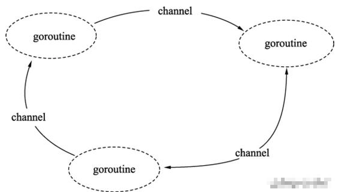
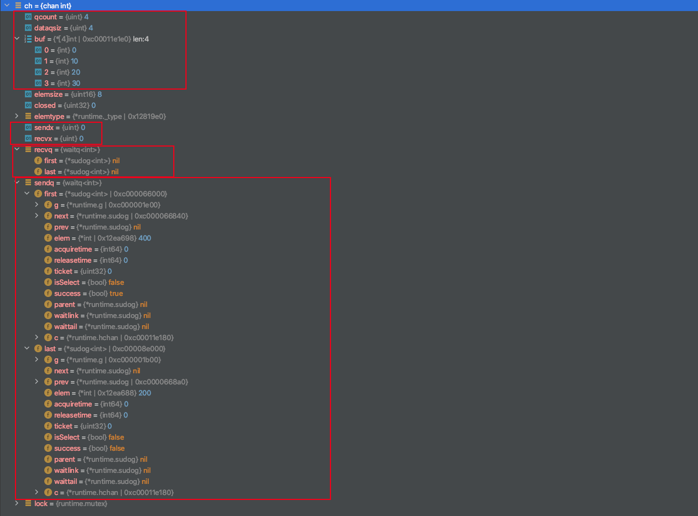

### channel的作用

众所周知，Go依赖于称为CSP（Communicating Sequential Processes）的并发模型，通过Channel实现这种同步模式。

Go并发的核心哲学是不要通过共享内存进行通信; 相反，通过沟通分享记忆。

> DO NOT COMMUNICATE BY SHARING MEMORY; INSTEAD, SHARE MEMORY BY COMMUNICATING.


如果程序设计成通过通信来共享数据的话，那么通信的两端是不是在同一个物理设备上就无所谓了，只有这样才能实现真正的分布式计算。

内存的话还要考虑内存拷贝

1. 首先，使用发送消息来同步信息相比于直接使用共享内存和互斥锁是一种更高级的抽象，使用更高级的抽象能够为我们在程序设计上提供更好的封装，让程序的逻辑更加清晰；

2. 其次，消息发送在解耦方面与共享内存相比也有一定优势，我们可以将线程的职责分成生产者和消费者，并通过消息传递的方式将它们解耦，不需要再依赖共享内存；

3. 最后，Go 语言选择消息发送的方式，通过保证同一时间只有一个活跃的线程能够访问数据，能够从设计上天然地避免线程竞争和数据冲突的问题；

   

channel一个Go的类型管道，通过它可以在goroutine之间发送和接收消息。它是Golang在语言层面提供的goroutine间的通信方式。



接下来我们通过源代码分析程序执行过程，在讲之前，如果不了解go 并发和调度相关知识。请阅读[GoRoutine理解](https://elvisng.github.io/2020/02/24/golang-routine/)


### Channel结构

hchan结构体

```go
type hchan struct {
    qcount   uint           // 循环队列中数据数
    dataqsiz uint           // 循环队列的大小
    buf      unsafe.Pointer // 指向大小为dataqsize的包含数据元素的数组指针
    elemsize uint16         // 数据元素的大小
    closed   uint32         // 代表channel是否关闭   
    elemtype *_type         // _type代表Go的类型系统，elemtype代表channel中的元素类型
    sendx    uint           // 发送索引号，初始值为0
    recvx    uint           // 接收索引号，初始值为0
    recvq    waitq          // 接收等待队列，存储试图从channel接收数据(<-ch)的阻塞goroutines
    sendq    waitq          // 发送等待队列，存储试图发送数据(ch<-)到channel的阻塞goroutines

    lock mutex              // 加锁能保护hchan的所有字段，包括waitq中sudoq对象
}
```

- waitq

waitq用于表达处于阻塞状态的goroutines链表信息，first指向链头goroutine，last指向链尾goroutine

```go
type waitq struct {
    first *sudog           
    last  *sudog
}
```

- sudug

sudog代表的就是一个处于等待列表中的goroutine对象

```go
type sudog struct {
    g *g
    next *sudog
    prev *sudog
    elem unsafe.Pointer // data element (may point to stack)
    c        *hchan // channel
  ...
}
```

为了更好理解channel的结构，我们通过以下代码来debug查看channel内部

```go
package main

import "time"

func goroutineA(ch chan int) {
	ch <- 100
}

func goroutineB(ch chan int) {
	ch <- 200
}

func goroutineC(ch chan int) {
	ch <- 300
}

func goroutineD(ch chan int) {
	ch <- 400
}

func main() {
	ch := make(chan int, 4)
	for i := 0; i < 4; i++ {
		ch <- i * 10
	}
	go goroutineA(ch)
	go goroutineB(ch)
	go goroutineC(ch)
	go goroutineD(ch)
	// 第一个sleep是为了给上足够的时间让所有goroutine都已启动
	time.Sleep(time.Millisecond * 500)
	time.Sleep(time.Second)//      <====debug
}
```

channel信息如下：



* buf里面存储了arr[0,10,20,30]四个元素的数组

* 因为往channel的循环队列塞入了四个元素，所以qcount为4
* 通过make(chan int,4 )定义的dataqsiz大小也为4ls
* 因为没有任何send和recv操作所以sendx和revx两个索引都为0
* goroutineA-D都是发送操作所以recvq为nil、nil，而sendq为A-D goRountine的发送链表的头尾指针
* 同时可以看到其实goroutine的并发是随机的，sendq头指针为400，尾指针为200


### channel操作

将channel操作分为四部分：创建、发送、接收和关闭。

#### 创建

创建channel 有两种，一种是带缓冲的channel，一种是不带缓冲的channel

```go
// 带缓冲
ch := make(chan int, 4)
// 不带缓冲
ch := make(chan int)
```

创建的底层实现

```go
func makechan(t *chantype, size int) *hchan {
	elem := t.elem

	// 发送元素大小限制
	if elem.size >= 1<<16 {
		throw("makechan: invalid channel element type")
	}
	if hchanSize%maxAlign != 0 || elem.align > maxAlign {
		throw("makechan: bad alignment")
	}
	//判断是否会内存溢出
	mem, overflow := math.MulUintptr(elem.size, uintptr(size))
	if overflow || mem > maxAlloc-hchanSize || size < 0 {
		panic(plainError("makechan: size out of range"))
	}

	//为构造的chan对象分配内存
	var c *hchan
	switch {
    //为无缓冲的channel生成channel对象
	case mem == 0:
		// Queue or element size is zero.
		c = (*hchan)(mallocgc(hchanSize, nil, true))
		// Race detector uses this location for synchronization.
		c.buf = c.raceaddr()
    // 元素不包含指针的情况
	case elem.ptrdata == 0:
		// Elements do not contain pointers.
		// Allocate hchan and buf in one call.
		c = (*hchan)(mallocgc(hchanSize+mem, nil, true))
		c.buf = add(unsafe.Pointer(c), hchanSize)
	default:
		// 元素包含指针
		c = new(hchan)
		c.buf = mallocgc(mem, elem, true)
	}
	//初始化相关参数
	c.elemsize = uint16(elem.size)
	c.elemtype = elem
	c.dataqsiz = uint(size)
  //互斥锁初始化
	lockInit(&c.lock, lockRankHchan)

	if debugChan {
		print("makechan: chan=", c, "; elemsize=", elem.size, "; dataqsiz=", size, "\n")
	}
	return c
}
```

#### 发送

发送过程，存在以下几种情况。

1. **当发送的channel为nil**

```go
var ch chan(int)
	go func() {
		ch <- 100
	}()
```

```go
if c == nil {
    if !block {
        return false
    }
    gopark(nil, nil, waitReasonChanSendNilChan, traceEvGoStop, 2)
    throw("unreachable")
}
```

往一个nil的channel中发送数据时，调用gopark函数将当前执行的goroutine从running态转入waiting态

2. **往已关闭的channel中发送数据**

```go
ch := make (chan int,4)
	close(ch)
	go func() {
		ch <- 100
	}()
```

```go
		if c.closed != 0 {
        unlock(&c.lock)
        panic(plainError("send on closed channel"))
    }
```

如果向已关闭的channel中发送数据，会引发panic。

3. **如果已经有阻塞的接收goroutines（即recvq中指向非空），那么数据将被直接发送给接收goroutine。**

```go
if sg := c.recvq.dequeue(); sg != nil {
    // Found a waiting receiver. We pass the value we want to send
    // directly to the receiver, bypassing the channel buffer (if any).
    send(c, sg, ep, func() { unlock(&c.lock) }, 3)
    return true
}
```

该逻辑的实现代码在send方法和sendDirect中。

```go
func send(c *hchan, sg *sudog, ep unsafe.Pointer, unlockf func(), skip int) {
  ... // 省略了竞态代码
    if sg.elem != nil {
        sendDirect(c.elemtype, sg, ep)
        sg.elem = nil
    }
    gp := sg.g
  //解锁在chansend()里面的c.lock
    unlockf()
    gp.param = unsafe.Pointer(sg)
    if sg.releasetime != 0 {
        sg.releasetime = cputicks()
    }
  	//把接收队列的第一个goroutine状态变成runnable
    goready(gp, skip+1)
}

func sendDirect(t *_type, sg *sudog, src unsafe.Pointer) {
    dst := sg.elem
    typeBitsBulkBarrier(t, uintptr(dst), uintptr(src), t.size)
    //内存src拷贝到goroutine的dst
    memmove(dst, src, t.size)
}
```

4. **对于有缓冲的**channel来说，如果当前缓冲区hchan.buf有可用空间，那么会将数据拷贝至缓冲区

```go
if c.qcount < c.dataqsiz {
		//获取指向对应内存区域的指针
    qp := chanbuf(c, c.sendx)
    if raceenabled {
        raceacquire(qp)
        racerelease(qp)
    }
   //内存拷贝
    typedmemmove(c.elemtype, qp, ep)
  // 发送索引号+1
    c.sendx++
  // 因为存储数据元素的结构是循环队列，所以当当前索引号已经到队末时，将索引号调整到队头
    if c.sendx == c.dataqsiz {
        c.sendx = 0
    }
  // 当前循环队列中存储元素数+1
    c.qcount++
    unlock(&c.lock)
    return true
}
```

5. **有缓冲的channel，当hchan.buf已满；或者无缓冲的channel，当前没有接收的goroutine**

```go
gp := getg()
mysg := acquireSudog()
mysg.releasetime = 0
if t0 != 0 {
    mysg.releasetime = -1
}
// No stack splits between assigning elem and enqueuing mysg
// on gp.waiting where copystack can find it.
mysg.elem = ep
mysg.waitlink = nil
mysg.g = gp
mysg.isSelect = false
mysg.c = c
gp.waiting = mysg
gp.param = nil
c.sendq.enqueue(mysg)
gopark(chanparkcommit, unsafe.Pointer(&c.lock), waitReasonChanSend, traceEvGoBlockSend, 2)
```

通过getg获取当前执行的goroutine。acquireSudog是先获得当前执行goroutine的线程M，再获取M对应的P，最后将P的sudugo缓存队列中的队头sudog取出（详见源码src/runtime/proc.go）。通过c.sendq.enqueue将sudug加入到channel的发送等待列表中，并调用gopark将当前goroutine转为waiting态。

可以看到，当没有接收groutine时，发送的goroutine将被置于sendq的发送队列中。


#### channel发送小结：

- 发送操作会对hchan加锁。
- 当recvq中存在等待接收的goroutine时，数据元素将会被直接拷贝给接收goroutine。
- 当recvq等待队列为空时，会判断hchan.buf是否可用。如果可用，则会将发送的数据拷贝至hchan.buf中。
- 如果hchan.buf已满，那么将当前发送goroutine置于sendq中排队，并在运行时中挂起。
- 向已经关闭的channel发送数据，会引发panic。


#### 接收

channel的接收实现分两种，v :=<-ch对应于chanrecv1，v, ok := <- ch对应于chanrecv2

```
func chanrecv1(c *hchan, elem unsafe.Pointer) {
    chanrecv(c, elem, true)
}

func chanrecv2(c *hchan, elem unsafe.Pointer) (received bool) {
    _, received = chanrecv(c, elem, true)
    return
}
```

#### channel接收小结：

chanrecv的详细代码此处就不再展示，和chansend逻辑对应，具体处理准则如下。

- 接收操作会对hchan加锁。

- 当sendq中存在等待发送的goroutine时，意味着此时的hchan.buf已满（无缓存的天然已满），分两种情况：

  1. 如果是有缓存的hchan，那么先将缓冲区的数据拷贝给接收goroutine，再将sendq的队头sudog出队，将出队的sudog上的元素拷贝至hchan的缓存区

  2. 如果是无缓存的hchan，那么直接将出队的sudog上的元素拷贝给接收goroutine。

     两种情况的最后都会唤醒出队的sudog上的发送goroutine。

- 当sendq发送队列为空时，会判断hchan.buf是否可用。如果可用，则会将hchan.buf的数据拷贝给接收goroutine。

- 如果hchan.buf不可用，那么将当前接收goroutine置于recvq中排队，并在运行时中挂起。

- 与发送不同的是，当channel关闭时，goroutine还能从channel中获取数据。如果recvq等待列表中有goroutines，那么它们都会被唤醒接收数据。如果hchan.buf中还有未接收的数据，那么goroutine会接收缓冲区中的数据，否则goroutine会获取到元素的零值。

- **注意：在channel中进行的所有元素转移都伴随着内存的拷贝。**

以下是channel关闭之后，接收goroutine的读取代码。

```go
func main() {
    ch := make(chan int, 1)
    ch <- 10
    close(ch)
    a, ok := <-ch
    fmt.Println(a, ok)
    b, ok := <-ch
    fmt.Println(b, ok)
    c := <-ch
    fmt.Println(c)
}

//输出如下
10 true
0 false  //如果关闭的channel读取会获得其类型的默认值
0
```


####  关闭

channel的关闭实现代码位于src/go/runtime/chan.go的chansend方法

```go
func closechan(c *hchan) {
  // 如果hchan对象为nil，则会引发painc
    if c == nil {
        panic(plainError("close of nil channel"))
    }

  // 对hchan加锁
    lock(&c.lock)
  // 不同多次调用close(c chan<- Type)方法，否则会引发painc
    if c.closed != 0 {
        unlock(&c.lock)
        panic(plainError("close of closed channel"))
    }
		//一些数据竞态检测
    if raceenabled {
        callerpc := getcallerpc()
        racewritepc(c.raceaddr(), callerpc, funcPC(closechan))
        racerelease(c.raceaddr())
    }

  // close标志
    c.closed = 1

  // gList代表Go的GMP调度的G集合
    var glist gList

    // 该for循环是为了释放recvq上的所有等待接收sudog
    for {
        sg := c.recvq.dequeue()
        if sg == nil {
            break
        }
        if sg.elem != nil {
            typedmemclr(c.elemtype, sg.elem)
            sg.elem = nil
        }
        if sg.releasetime != 0 {
            sg.releasetime = cputicks()
        }
        gp := sg.g
        gp.param = nil
        if raceenabled {
            raceacquireg(gp, c.raceaddr())
        }
        glist.push(gp)
    }

    // 该for循环会释放sendq上的所有等待发送sudog
    for {
        sg := c.sendq.dequeue()
        if sg == nil {
            break
        }
        sg.elem = nil
        if sg.releasetime != 0 {
            sg.releasetime = cputicks()
        }
        gp := sg.g
        gp.param = nil
        if raceenabled {
            raceacquireg(gp, c.raceaddr())
        }
        glist.push(gp)
    }
  // 释放sendq和recvq之后，hchan释放锁
    unlock(&c.lock)

  // 将上文中glist中的加入的goroutine取出，让它们均变为runnable（可执行）状态，等待调度器执行
    // 注意：我们上文中分析过，试图向一个已关闭的channel发送数据，会引发painc。
  // 所以，如果是释放sendq中的goroutine，它们一旦得到执行将会引发panic。
    for !glist.empty() {
        gp := glist.pop()
        gp.schedlink = 0
        goready(gp, 3)
    }
}
```

#### channel关闭小结：

- 如果关闭已关闭的channel会引发painc。
- 对channel关闭后，如果有阻塞的读取或发送goroutines将会被唤醒。读取goroutines会获取到hchan的已接收元素，如果没有，则获取到元素零值；发送goroutine的执行则会引发painc。


### 总结

channel是Go中并发中很重要的数据类型，所以了解其原理能更使得我们的goRoutine使用得更加高效。如果你要更高效的使用channel，请记下以下几点：

- hchan结构体有锁的保证，对于并发goroutine而言是安全的
- channel接收、发送数据遵循FIFO（First In First Out）原语
- channel的数据传递依赖于内存拷贝
- channel能阻塞（gopark）、唤醒（goready）goroutine
- 所谓无缓存的channel，它的工作方式就是直接发送goroutine拷贝数据给接收goroutine，而不通过hchan.buf

