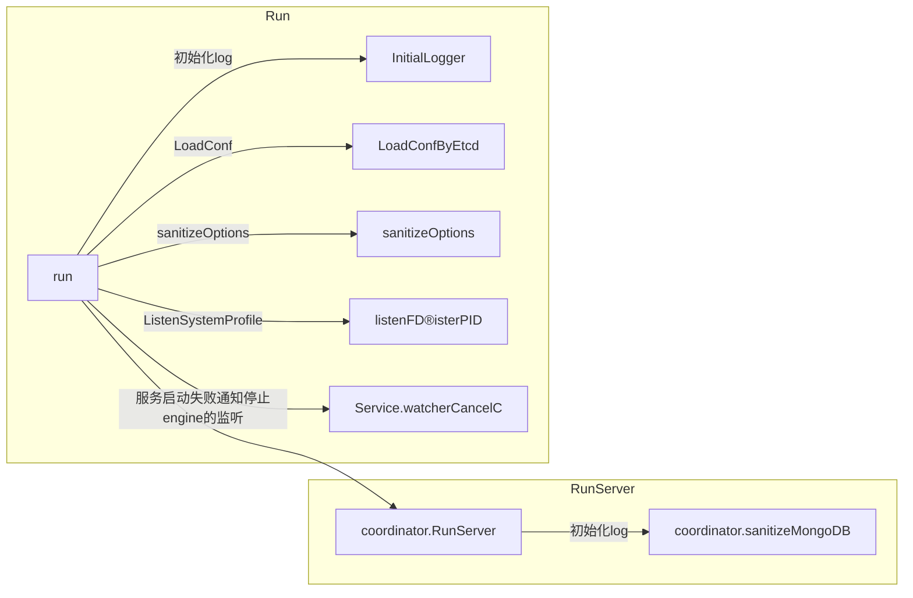

框架链路如下：

# 注：Blog无法支持mermaid，正在解决，请把submermaid拷贝到Typora中查看。
Typora:
[下载地址](https://typora.io/)" 

框架调用链路图

```mermaid
graph LR
  subgraph RunServer
  	coordinator.RunServer-->|初始化log| coordinator.sanitizeMongoDB
  	
  end
  subgraph Run
    	run-->|初始化log| InitialLogger
    	run-->|LoadConf| LoadConfByEtcd
    	run-->|sanitizeOptions| sanitizeOptions
    	run-->|ListenSystemProfile| listenFD&registerPID
    	run-->coordinator.RunServer
    	run-->|服务启动失败通知停止engine的监听|Service.watcherCancelC
  end
```

