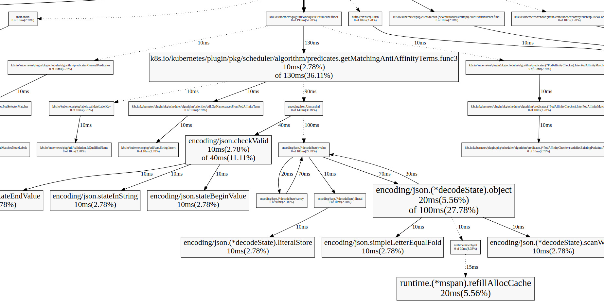
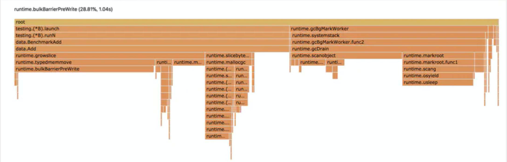
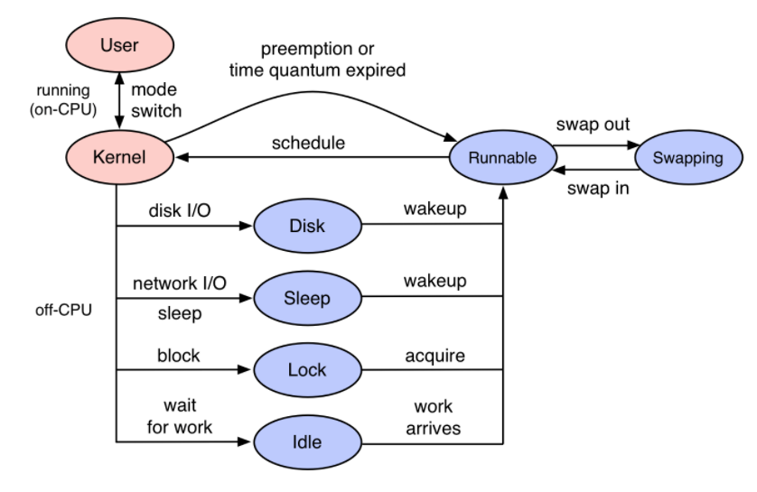
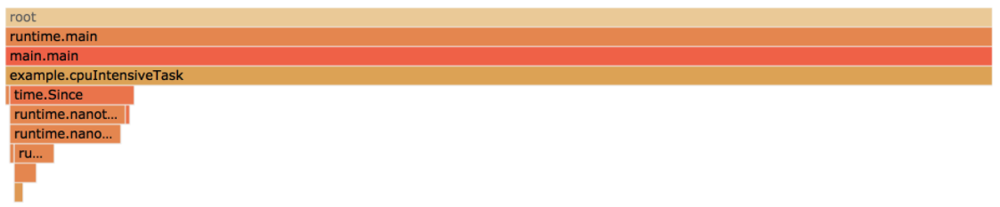
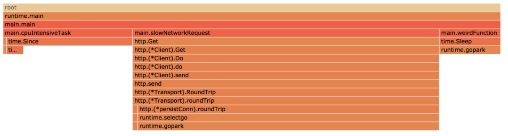

## Go常用的性能分析工具：

​		**pprof:  On-Cpu Profile Memory GoRoutine**

​		**fgprof: On-Cpu/Off-Cpu**

​		**trace:   For trace RunTime bugs**

​		**perf:    when no pprof**


### pprof

##### 支持什么使用模式

- Report generation：报告生成
- Interactive terminal use：交互式终端使用
- Web interface：Web 界面

##### 可以做什么

- CPU Profiling：CPU 分析，按照一定的频率采集所监听的应用程序 CPU（含寄存器）的使用情况，可确定应用程序在主动消耗 CPU 周期时花费时间的位置
- Memory Profiling：内存分析，在应用程序进行堆分配时记录堆栈跟踪，用于监视当前和历史内存使用情况，以及检查内存泄漏
- Block Profiling：阻塞分析，记录 goroutine 阻塞等待同步（包括定时器通道）的位置
- Mutex Profiling：互斥锁分析，报告互斥锁的竞争情况


举一个broccoli里面的pprof的监控例子：


```go
var (
	_perfOnce sync.Once
)

// 启动监听pprof
func StartPerf(pprofc config.PProf) {
	_perfOnce.Do(func() {
		mux := http.NewServeMux()
		mux.HandleFunc("/debug/pprof/", pprof.Index)
		mux.HandleFunc("/debug/pprof/cmdline", pprof.Cmdline)
		mux.HandleFunc("/debug/pprof/profile", pprof.Profile)
		mux.HandleFunc("/debug/pprof/symbol", pprof.Symbol)

		go func() {
			if pprofc.HostURI == "" {
				panic(errors.Errorf("pprof: http perf must be set tcp://$host:port ", pprofc.HostURI))
			}
			if err := http.ListenAndServe(pprofc.HostURI, mux); err != nil {
				panic(errors.Errorf("pprof: listen %s: error(%v)", pprofc.HostURI, err))
			}
		}()
	})
}
```

详细的框架实现可以[点击了解broccoli框架](https://github.com/elvisNg/broccoliv2/blob/main/pprof/perf.go)


服务起来之后，就会多多一条路由，如`http://127.0.0.1:8000/debug/pprof`，有以下输出

```go
/debug/pprof/
 
profiles:
0    block
62    goroutine
444    heap
30    threadcreate
 
full goroutine stack dump
```


这个路径下还有几个子页面：

- `/debug/pprof/profile`：访问这个链接会自动进行 CPU profiling，持续 30s，并生成一个文件供下载
- `/debug/pprof/heap`： Memory Profiling 的路径，访问这个链接会得到一个内存 Profiling 结果的文件
- `/debug/pprof/block`：block Profiling 的路径
- `/debug/pprof/goroutines`：运行的 goroutines 列表，以及调用关系


##### 还可以生成关系拓扑图：

```go
go tool pprof helloworld demoprof.prof
(pprof) web  #生成调用关系图，demo.svg文件
```




每个方框代表一个函数，方框的大小和执行时间成正比，箭头代表调用关系，箭头上的时间代表被调用函数的执行时间

从上图可以看出很多分析点：

<u>如: 从上图可以看出json转码效率并没那么高，通信可以采取更便捷的二进制文件，例如：proto</u>


##### **生成火焰图**:

- 先下载 `[go-torch](https://github.com/uber/go-torch)`工具
- 生成 火焰图

```text
go-torch  -u url( 选择是 CPU 或是 memory 等的 profile 文件 )
```



可以看到这个cpu-profile分析东西

<u>如：runtime.bulkBarrierPreWrite 这个是gc的读写屏障，一般超过20%已经算高的了，现在是28.81%，所以看出gc的cpu调用过高，进一步分析可能出现指针逃逸等导致heap分配过大导致gc调用过多等</u>


### fgprof

> fgprof is implemented as a background goroutine that wakes up 99 times per second and calls runtime.GoroutineProfile. This returns a list of all goroutines regardless of their current On/Off CPU scheduling status and their call stacks.

- **On-CPU**: 线程花费在CPU上的时间。

- **Off-CPU**: 线程阻塞在I/O、锁、计时器、页交换等场景中的等待时间。

  

  从上图可以知道，当遇到线程block，或者network的IO阻塞，单靠pprof对于On-Cpu的分析是没办法从火焰图上得到Off-Cpu的阻塞性能分析的

##### 举个例子：

假如给你一个任务，要你优化下面的代码。这是一个简单的程序，在一个循环中调用三个函数。

```
func main() {
	for {
		// http调用函数，可能比较慢
		slowNetworkRequest()
		// 很重的CPU计算
		cpuIntensiveTask()
		// 未知的函数，不知道它执行的快慢
		weirdFunction()
	}
}
```

一种方式就是包装一个函数，以便计算它们的时间消耗：

```
start := time.Start()
slowNetworkRequest()
fmt.Printf("slowNetworkRequest: %s\n", time.Since(start))
// ...
```

但是这样做太糟糕了，你需要在每个函数前后都加上统计时间的代码。如果你使用`/debug/pprof/profile`进行分析的话, 可以修改代码：

```
import _ "net/http/pprof"

func main() {
	go func() {
		log.Println(http.ListenAndServe(":6060", nil))
	}()

	// <code to profile>
}
```

然后使用pprof进行分析`go tool pprof -http=:6061 http://localhost:6060/debug/pprof/profile?seconds=10`:



看起来是cpuIntensiveTask占比最高。但是查看我们的日志，根据日志中打印出来的每个函数调用的耗时:

```
slowNetworkRequest: 66.815041ms
cpuIntensiveTask: 30.000672ms
weirdFunction: 10.64764ms
slowNetworkRequest: 67.194516ms
cpuIntensiveTask: 30.000912ms
weirdFunction: 10.105371ms
// ...
```

实际上是slowNetworkRequest耗时最久，但是上面的火焰图却没反应出来，这个火焰图只显示了那个函数占用CPU的时间最多，也就是On-CPU的性能分析。

那么如何都显示Off-Cpu负载的情况呢，可以使用fgprof，你可以在http中配置一个handler:

```
import(
	_ "net/http/pprof"
	"github.com/felixge/fgprof"
)

func main() {
	http.DefaultServeMux.Handle("/debug/fgprof", fgprof.Handler())
	go func() {
		log.Println(http.ListenAndServe(":6060", nil))
	}()

	// <code to profile>
}
```

然后执行`go tool pprof --http=:6061 http://localhost:6060/debug/fgprof?seconds=10`,最终mian这三个函数正常的显示了，而且正确显示花在它们上面的时间。



 从上图可以看出slowNetworkfRequest耗时事最高的，整个程序是卡在了network的IO上，所以可以进一步对于NetWork的IO进行优化。

你可以把它配置在你自己的web框架中，但博主封装的[Broccoli框架](https://github.com/elvisNg/broccoliv2/)并没有这样做，那是为什么呢？


因为fgprof 是启动了一个后台的 goroutine，每秒启动 99 次，调用 runtime.GoroutineProfile 来采集所有 gorooutine 的栈。

虽然看起来很美好：

```go
func GoroutineProfile(p []StackRecord) (n int, ok bool) {
    .....
	stopTheWorld("profile")

	for _, gp1 := range allgs {
		......
	}

	if n <= len(p) {
		// Save current goroutine.
		........
		systemstack(func() {
			saveg(pc, sp, gp, &r[0])
		})

		// Save other goroutines.
		for _, gp1 := range allgs {
			if isOK(gp1) {
				.......
				saveg(^uintptr(0), ^uintptr(0), gp1, &r[0])
                .......
			}
		}
	}

	startTheWorld()

	return n, ok
}
```

但调用 GoroutineProfile 函数的开销并不低，如果线上Broccoli框架封装的认证系统或者中台系统的 goroutine经常上万，每次采集 profile 都遍历上万个 goroutine 的成本实在是太高了。所以 fgprof 一般只在线下排查问题单独使用，下一篇将讲博主怎么使用fgprof排查现实问题的。

### trace

一般情况下我们是不需要使用 trace 来定位性能问题的，通过压测 + profile 就可以解决大部分问题，除非我们的问题与 runtime 本身的问题相关。

比如 STW 时间比预想中长，超过百毫秒，向官方反馈问题时，才需要出具相关的 trace 文件。比如类似 [long stw](https://github.com/golang/go/issues/19378) 这样的 issue。

后面会单独发一篇关于gc和golang内存分配上的文章会根据trace导出其stw等的操作耗时等更加内核追踪性能。上面会详细使用到trace。


今天的学习分享到此结束，欢迎交流呀～