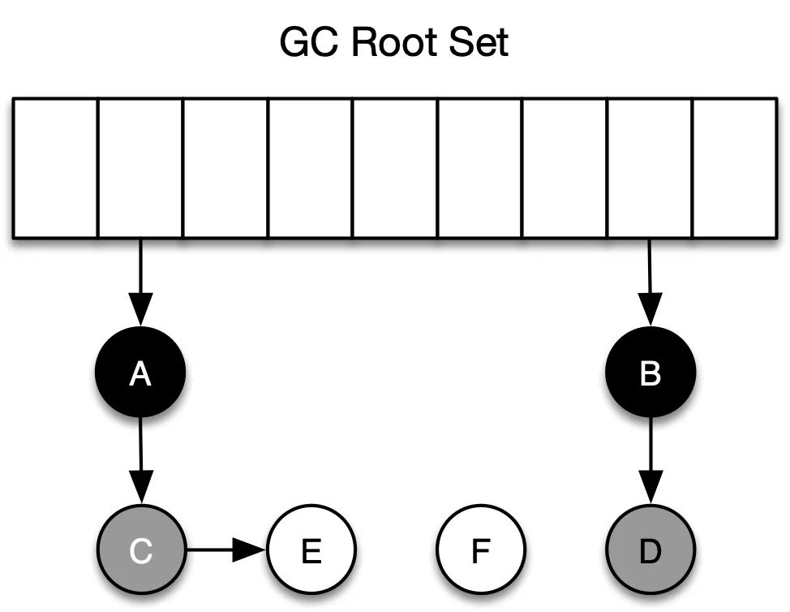
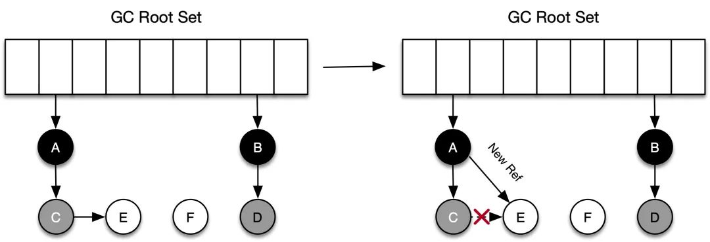

### GC算法与回收思想


#### GC 的定义

> 首先我们来看一下什么是 GC。

GC 把程序不用的内存空间视为「垃圾」，（几乎所有的）GC 要做的就只有两件事：

- 找到内存空间里的垃圾，使其和活对象分开来。

- 回收垃圾对象的内存，使得程序可以重复使用这些内存。


#### GC流派

* 基于可达性分析的 GC
* 基于引用计数法的 GC


**可达性分析法**


基本思路就是通过根集合（gc root）作为起始点，从这些节点出发，根据引用关系开始搜索，所经过的路径称为引用链，当一个对象没有被任何引用链访问到时，则证明此对象是不活跃的，可以被回收。使用此类算法的有JVM、Golang等。


**引用计数法**


引用计数法没有用到gc root概念。其基本原理是：每个单元维护一个域，保存其它单元指向它的引用数量（类似有向图的入度）。当引用数量为 0 时，将其回收。使用此类算法的有 Python、Objective-C等。


基于可达性分析法的 GC 垃圾回收的效率较高，实现起来比较简单（引用计算法是是算法简单，实现较难），但是其缺点在于 GC 期间，整个应用需要被挂起（STW，Stop-the-world，下同），后面很多此类算法的提出，都是在解决这个问题（缩小 STW 时间）。


##### 两种流派的优缺点

1. 可达性分析**GC垃圾回收效率高**，主要体现在并发回收、GCWorker等，下面会讲到，但是其缺点在GC期间，整个**应用需要被挂起**（Stop-the-world），包括后面基于这个流派的算法提出都在解决这个问题（缩小STW时间）。

2. 引用计数法GC可与应用交替运行，**不需要暂停应用**；同时回收发生在计数器为0的时候，**回收速度更快**，相比于其他垃圾回收算法，堆被耗尽或者达到某个阈值才会进行垃圾回收。

   引用计数算法**无法解决「循环引用无法回收」的问题**，即两个对象互相引用，所以各对象的计数器的值都是 1，即使这些对象都成了垃圾（无外部引用），GC 也无法将它们回收。

   引用计数算法最大的问题在于：计数器值的增减处理非常繁重，譬如对根对象的引用，此外，多个线程之间共享对象时需要对计数器进行原子递增/递减，这本身又带来了一系列新的复杂性和问题，计数器对应用程序的整体运行速度降低的影响。


#### GC基本算法：三色标记法

三色标记算法属于可达性分析类 GC， 背后的首要原则就是把堆中的对象根据它们的颜色分到不同集合里面，这三种颜色和所包含的意思分别如下所示：

- 白色：还未被垃圾回收器标记的对象
- 灰色：自身已经被标记，但其拥有的成员变量还未被标记
- 黑色：自身已经被标记，且对象本身所有的成员变量也已经被标记


在 GC 开始阶段，刚开始所有的对象都是白色的，在通过可达性分析时，首先会从根节点开始遍历。

1. 起初所有对象都是白色。
2. 从根出发扫描所有可达对象，标记为灰色，放入待处理队列。
3. 从队列取出灰色对象，将其引用对象标记为灰色放入队列，自身标记为黑色。
4. 重复 3，直到灰色对象队列为空。此时白色对象即为垃圾，进行回收。

下面是第一轮标记结束后，各个对象的颜色分布。




**读屏障&&写屏障**


在标记对象是否存活的过程中，对象间的引用关系是不能改变的，但如果对于并发语言来说，在分析对象引用关系期间，对象间引用关系的建立和销毁是肯定存在的，如果没有其他补偿手段，并发标记期间就可能出现对象多标和漏标的情况。

还是以上面三色标记法中的例子说明：

（1）多标

假设 C 被标为灰色后，在进行清扫之前，A 和 C 之间的引用关系解除了（应用程序），按照三色标记法，C 和 E 都应该是垃圾，而事实上，C 不会在本轮 GC 活动中被回收，这部分本应该回收但是没有回收到的内存，被称之为「浮动垃圾」，这种标记问题称为多标。

（2）漏标

如下图所示，对象 C 在被标记为灰色后，对象 C 断开了和对象 E 之间的引用，同时对象 A 新建了和对象 E 之间的引用。在进行后面的标记时，因为 C 没有对 E 的引用，所以不会将 E 放到灰色集合，虽然 A 重新引用了 E，但因为 A 已经是黑色了，不会再返回重新进行深度遍历了。最终导致的结果是：对象 E 会一直停留在白色集合中，最后被当作垃圾回收，事实上 E 却是活动对象，这种情况也是不可接受的。


> 多标不会影响程序的正确性，只会推迟垃圾回收的时机，漏标会影响程序的正确性，需要引入读写屏障来解决漏标的问题。

#### 读写屏障 (read/write barrier)

GC 里的读屏障（Read barrier）和写屏障（Write barrier）指的是编译器在从堆中读取引用或更新堆中引用时，GC 特意插入一段代码，在进行读/写引用时，会额外执行这些指令，把其内存改变的操作记录下来。

读/写屏障实现的是「对读/写引用这个操作的环切」，即该操作前后都在屏障的范畴内，可以将读/写屏障类比于 Spirng 框架里的拦截器。下面所示的代码，当从 foo 的成员变量第一次从堆上被加载时，就会触发读屏障（后续使用该引用不会触发 ），而当 bar 的成员变量(引用类型的)被分配/写入时，会触发写屏障。


```go
func main() {
	userInfo := elvis.userINfo    // ===>读屏障
	jj.Info = getUserInfo.       //  ===>写屏障
}
```


读写屏障是如何解决并发标记时的多标漏标的？

1. 应用线程插入了一个从黑色对象（A）到白色对象（E）的新引用，则E成为了脏数据。（漏标）
2. 应用线程删除了从灰色对象（C）到白色对象（E）的直接或者间接引用，则C成为了脏数据。（多标）




#### 读写屏障解决标记问题

1. 开启写屏障，当新增引用关系后，触发写屏障，发出引用的黑色或者白色对象会被标记成灰色（例子中 A 将被标记为灰色并进入灰色集合），或者将被引用对象标记为灰色。
2. 开启读屏障，当检测到应用即将要访问白色对象时，触发读屏障，GC 会立刻访问该对象并将之标为灰色。这种方法被称为「增量更新（Increment Update）」。


### Golang GC 实现


#### Gc何时触发

在堆上分配大于 32K byte 对象的时候进行检测此时是否满足垃圾回收条件，如果满足则进行垃圾回收。

```go
func mallocgc(size uintptr, typ *_type, needzero bool) unsafe.Pointer {
    ...
    shouldhelpgc := false
    // 分配的对象小于 32K byte
    if size <= maxSmallSize {
        ...
    } else {
        shouldhelpgc = true
        ...
    }
    ...
    // gcShouldStart() 函数进行触发条件检测
    if shouldhelpgc && gcShouldStart(false) {
        // gcStart() 函数进行垃圾回收
        gcStart(gcBackgroundMode, false)
    }
}
```

还有一种是主动垃圾回收，通过调用 runtime.GC()，这是阻塞式的。

```go
// GC runs a garbage collection and blocks the caller until the
// garbage collection is complete. It may also block the entire
// program.
func GC() {
    gcStart(gcForceBlockMode, false)
}
```


#### GC 触发条件

触发条件主要关注下面代码中的中间部分：`forceTrigger || memstats.heap_live >= memstats.gc_trigger` 。

forceTrigger 是 forceGC 的标志；后面半句的意思是当前堆上的活跃对象大于我们初始化时候设置的 GC 触发阈值。malloc()和free()会动态更新活跃对象memstats.heap_live

```go
// gcShouldStart returns true if the exit condition for the _GCoff
// phase has been met. The exit condition should be tested when
// allocating.
//
// If forceTrigger is true, it ignores the current heap size, but
// checks all other conditions. In general this should be false.
func gcShouldStart(forceTrigger bool) bool {
    return gcphase == _GCoff && (forceTrigger || memstats.heap_live >= memstats.gc_trigger) && memstats.enablegc && panicking == 0 && gcpercent >= 0
}

//初始化的时候设置 GC 的触发阈值
func gcinit() {
    _ = setGCPercent(readgogc())
    memstats.gc_trigger = heapminimum
    ...
}
// 启动的时候通过 GOGC 传递百分比 x
// 触发阈值等于 x * defaultHeapMinimum (defaultHeapMinimum 默认是 4M)
func readgogc() int32 {
    p := gogetenv("GOGC")
    if p == "off" {
        return -1
    }
    if n, ok := atoi32(p); ok {
        return n
    }
    return 100
}
```


#### 垃圾回收的主要流程

三色标记法，主要流程如下：

- 所有对象最开始都是白色。
- 从 root 开始找到所有可达对象，标记为灰色，放入待处理队列。
- 遍历灰色对象队列，将其引用对象标记为灰色放入待处理队列，自身标记为黑色。
- 处理完灰色对象队列，执行清扫工作。


具体流程可以参考下面这个经典图列


关于上图有几点需要说明的是

1. 首先从 root 开始遍历，root 包括全局指针和 goroutine 栈上的指针。
2. mark 有两个过程。
   1. 从 root 开始遍历，标记为灰色。遍历灰色队列。
   2. Mark Termination里面的re-scan 全局指针和栈。因为 mark 和用户程序是并行的，所以在过程 1 的时候可能会有新的对象分配，这个时候就需要通过写屏障（write barrier）记录下来。re-scan 再完成检查一下。
3. Stop The World 有两个过程。
   1. 第一个是 GC 将要开始的时候，这个时候主要是一些准备工作，比如 enable write barrier。
   2. 第二个过程就是上面提到的 re-scan 过程。如果这个时候没有 stw，那么 mark 将无休止，不断的会有新的引用写入到write barrier中

另外针对上图各个阶段对应 GCPhase （状态阶段）可以分为下面三个：

- **_GCoff**:                                    Off
- **_GCmark**:                               Stack scan ~ Mark
- **_GCmarktermination**:        Mark termination


版本golang v 1.16.2

**下面来展开说说GCPhase**

##### 1. _GCoff

在 GC 开始之前的准备工作。

```go
// gcStart starts the GC. It transitions from _GCoff to _GCmark (if
// debug.gcstoptheworld == 0) or performs all of GC (if
// debug.gcstoptheworld != 0).
//
// This may return without performing this transition in some cases,
// such as when called on a system stack or with locks held.
func gcStart(trigger gcTrigger) {
	...
	mode := gcBackgroundMode
  //如果forceMode则直接跳转到_GCmarktermination
	if debug.gcstoptheworld == 1 {
		mode = gcForceMode
	} else if debug.gcstoptheworld == 2 {
		mode = gcForceBlockMode
	}
	...
  //启动MarkStartWorkers的goroutine
	gcBgMarkStartWorkers()
  // Stop The World
	systemstack(gcResetMarkState)
   ...
	//处理设置 GCPhase，setGCPhase 还会 enable write barrier
	setGCPhase(_GCmark)

	gcBgMarkPrepare() // Must happen before assist enable.
	gcMarkRootPrepare()

	gcMarkTinyAllocs()
	...
}
```

##### 2._GCmark

Mark 阶段是并行的运行，通过在后台一直运行 mark worker 来实现。

```go
func gcBgMarkStartWorkers() {
	for gcBgMarkWorkerCount < gomaxprocs {
    // mark方法.  ==<看这里
		go gcBgMarkWorker()

		notetsleepg(&work.bgMarkReady, -1)
		noteclear(&work.bgMarkReady)
		gcBgMarkWorkerCount++
	}
}

// gcBgMarkWorker 是一直在后台运行的，大部分时候是休眠状态，通过 gcController 来调度
func gcBgMarkWorker() {
	...
	for {
		// Go to sleep until woken by
		// gcController.findRunnableGCWorker.
		gopark(func(g *g, nodep unsafe.Pointer) bool {
			...//一些系统协程调度优化

			// gcBgMarkWorkerPool 优化
			gcBgMarkWorkerPool.push(&node.node)
		 ...
		//// mark 过程
		systemstack(func() {
			// Mark our goroutine preemptible so its stack
			// can be scanned. This lets two mark workers
			// scan each other (otherwise, they would
			// deadlock). We must not modify anything on
			// the G stack. However, stack shrinking is
			// disabled for mark workers, so it is safe to
			// read from the G stack.
			casgstatus(gp, _Grunning, _Gwaiting)
			switch pp.gcMarkWorkerMode {
			default:
				throw("gcBgMarkWorker: unexpected gcMarkWorkerMode")
			case gcMarkWorkerDedicatedMode:
				gcDrain(&pp.gcw, gcDrainUntilPreempt|gcDrainFlushBgCredit)
				if gp.preempt {
					// We were preempted. This is
					// a useful signal to kick
					// everything out of the run
					// queue so it can run
					// somewhere else.
					lock(&sched.lock)
					for {
						gp, _ := runqget(pp)
						if gp == nil {
							break
						}
						globrunqput(gp)
					}
					unlock(&sched.lock)
				}
				// Go back to draining, this time
				// without preemption.
				gcDrain(&pp.gcw, gcDrainFlushBgCredit)
			case gcMarkWorkerFractionalMode:
				gcDrain(&pp.gcw, gcDrainFractional|gcDrainUntilPreempt|gcDrainFlushBgCredit)
			case gcMarkWorkerIdleMode:
				gcDrain(&pp.gcw, gcDrainIdle|gcDrainUntilPreempt|gcDrainFlushBgCredit)
			}
			casgstatus(gp, _Gwaiting, _Grunning)
		})

		// Account for time.
		...

		// Was this the last worker and did we run out
		// of work?
		...
			gcMarkDone()
		}
	}
}
```

Mark 阶段的标记代码主要在函数 gcDrain() 中实现。

```go
func gcDrain(gcw *gcWork, flags gcDrainFlags) {
	if !writeBarrier.needed {
		throw("gcDrain phase incorrect")
	}
  ...//一些markingWorker的提取与检查
	// Drain root marking jobs.
	if work.markrootNext < work.markrootJobs {
		// Stop if we're preemptible or if someone wants to STW.
		for !(gp.preempt && (preemptible || atomic.Load(&sched.gcwaiting) != 0)) {
			job := atomic.Xadd(&work.markrootNext, +1) - 1
			if job >= work.markrootJobs {
				break
			}
			markroot(gcw, job)
			if check != nil && check() {
				goto done
			}
		}
	}

	// Drain heap marking jobs.
	// Stop if we're preemptible or if someone wants to STW.
	for !(gp.preempt && (preemptible || atomic.Load(&sched.gcwaiting) != 0)) {
		if work.full == 0 {
			gcw.balance()
		}
		//获取灰色队列中的对象
		b := gcw.tryGetFast()
		if b == 0 {
			b = gcw.tryGet()
			if b == 0 {
				// Flush the write barrier
				// buffer; this may create
				// more work.
				wbBufFlush(nil, 0)
				b = gcw.tryGet()
			}
		}
		if b == 0 {
			// Unable to get work.
			break
		}
    //扫描灰色对象的引用对象，标记为灰色，入灰色队列
		scanobject(b, gcw)
	...

}
```

 3. Mark termination (STW phase 2)

mark termination 阶段会 stop the world。函数实现在 `gcMarkTermination()`。1.8 版本以后已经不会再对 goroutine stack 进行 re-scan 了，采用一种混合的 write barrier 方式来处理，详细有大神已经写得很好了，请看：[Go写屏障技术](https://golang.design/under-the-hood/zh-cn/part2runtime/ch08gc/barrier/)

```go
func gcMarkTermination() {
    // World is stopped.
    // Run gc on the g0 stack. We do this so that the g stack
    // we're currently running on will no longer change. Cuts
    // the root set down a bit (g0 stacks are not scanned, and
    // we don't need to scan gc's internal state).  We also
    // need to switch to g0 so we can shrink the stack.
    systemstack(func() {
        gcMark(startTime)
        // Must return immediately.
        // The outer function's stack may have moved
        // during gcMark (it shrinks stacks, including the
        // outer function's stack), so we must not refer
        // to any of its variables. Return back to the
        // non-system stack to pick up the new addresses
        // before continuing.
    })
    ...
}
```

### 清扫

清扫相对来说就简单很多了。

```
func gcSweep(mode gcMode) {
    ...
    //阻塞式
    if !_ConcurrentSweep || mode == gcForceBlockMode {
        // Special case synchronous sweep.
        ...
        // Sweep all spans eagerly.
        for sweepone() != ^uintptr(0) {
            sweep.npausesweep++
        }
        // Do an additional mProf_GC, because all 'free' events are now real as well.
        mProf_GC()
        mProf_GC()
        return
    }
  	
    // 并行式
    // Background sweep.
    lock(&sweep.lock)
    if sweep.parked {
        sweep.parked = false
        ready(sweep.g, 0, true)
    }
    unlock(&sweep.lock)
}
```

对于并行式清扫，在 GC 初始化的时候就会启动 `bgsweep()`，然后在后台一直循环。

```go
func bgsweep(c chan int) {
    sweep.g = getg()

    lock(&sweep.lock)
    sweep.parked = true
    c <- 1
    goparkunlock(&sweep.lock, "GC sweep wait", traceEvGoBlock, 1)

    for {
        for gosweepone() != ^uintptr(0) {
            sweep.nbgsweep++
            Gosched()
        }
        lock(&sweep.lock)
        if !gosweepdone() {
            // This can happen if a GC runs between
            // gosweepone returning ^0 above
            // and the lock being acquired.
            unlock(&sweep.lock)
            continue
        }
        sweep.parked = true
        goparkunlock(&sweep.lock, "GC sweep wait", traceEvGoBlock, 1)
    }
}

func gosweepone() uintptr {
    var ret uintptr
    systemstack(func() {
        ret = sweepone()
    })
    return ret
}
```

不管是阻塞式还是并行式，都是通过 `sweepone()`函数来做清扫工作的。如果对于[Golang 内存管理](https://elvisng.github.io/2020/11/27/golang-memory/)熟悉的话，这个地方就很好理解。内存管理都是基于 span 的，mheap_ 是一个全局的变量，所有分配的对象都会记录在 mheap_ 中。在标记的时候，我们只要找到对对象对应的 span 进行标记，清扫的时候扫描 span，没有标记的 span 就可以回收了。

```go
// sweeps one span
// returns number of pages returned to heap, or ^uintptr(0) if there is nothing to sweep
func sweepone() uintptr {
    ...
    for {
        s := mheap_.sweepSpans[1-sg/2%2].pop()
        ...
        if !s.sweep(false) {
            // Span is still in-use, so this returned no
            // pages to the heap and the span needs to
            // move to the swept in-use list.
            npages = 0
        }
    }
}

// Sweep frees or collects finalizers for blocks not marked in the mark phase.
// It clears the mark bits in preparation for the next GC round.
// Returns true if the span was returned to heap.
// If preserve=true, don't return it to heap nor relink in MCentral lists;
// caller takes care of it.
func (s *mspan) sweep(preserve bool) bool {
    ...
}
```


### 小结

Go 语言垃圾收集器的实现非常复杂，在分析垃圾收集器的过程中不得不省略很多的实现细节，其中包括并发标记对象的过程、清扫垃圾的具体实现，这些过程设计大量底层的位操作和指针操作。垃圾回收的执行速度往往很大程度上决定了整个程序的运行速度。这篇文章只是站在了很基础的使用者角度探究GC回收的主要步骤，至于GO底层怎么样做到让GC与用户程序并发执行，用适当的CPU去回收掉内存。TODO以后再一起探究这部分。