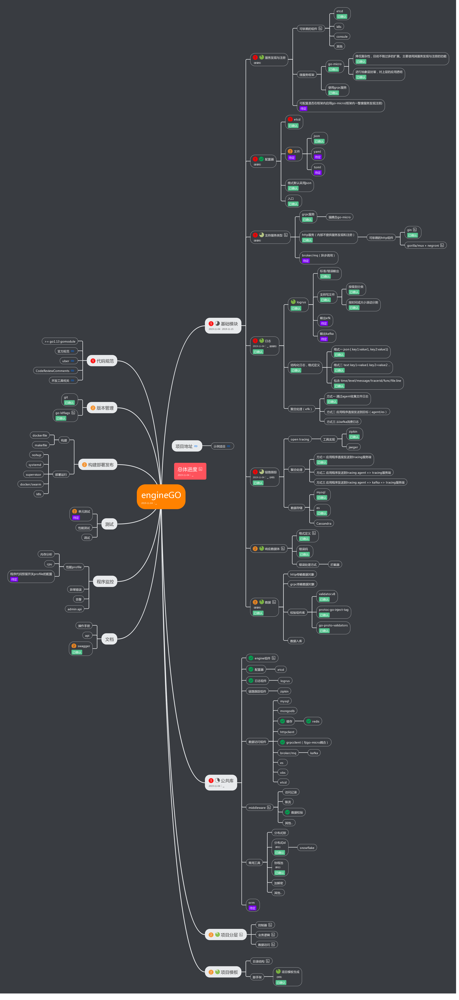
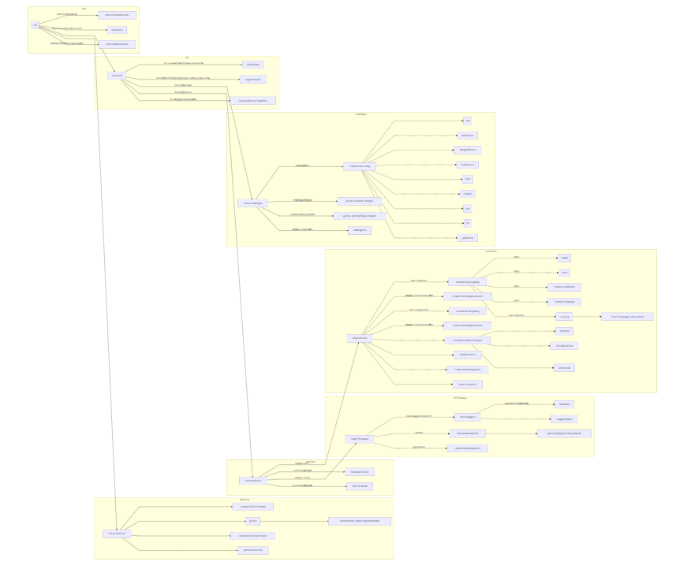

### broccoli框架目标

broccoli致力于将 Go 微服务框架标准化，统一错误码、日志、监控、注册、流控的 Schema。将微服务的各个模块可观测、可治理，管理微服务研发侧的全套生命周期。


### broccoli功能点

- gRPC：强耦合go-micro
- 配置：使用文件或etcd方式管理配置，规范化核心配置，结合远程配置中心，实现配置版本管理和更新，查看配置依赖关系；
- 日志：基于 logrus 日志类库，实现高性能日志库，、实现日志库的分级，并按时间或大小分割，已实现agent写日志格式，通过filebeat上报elk；
- 监控：基于 prometheus go sdk 类库，实现对服务端，客户端的数据监控，并自定义exporter，实现与 mysql、redis、etcd 、httpclient/server、grpcclient/server等的业务数据打通，实现应用自动化数据采集，形成数据化可视大图；
- 数据库：基于 gorm 的封装，将数据库的 trace，慢日志，监控，业务日志进行了采集；基于mongo-go-driver的封装实现连接池服用，批量提交，业务trace注入等的采集
- 缓存：基于 go-redis 的封装，将数据库的 trace，慢日志，监控，业务日志进行了采集，并实现了单个 redis、多从库 redis，客户端 redis 分片，服务端 redis 分片的 api；
- 系统错误码：区分框架和业务的错误码，将框架错误码文档自动生成，基于prometheus的自动化的错误码归类分析工具；
- 工程化：基于服务标准，代码规范，框架容器标准生成标准的项目分层的目录结构，项目模版工程化；
- 服务治理：基于prometheus，etcd，配置中心，对服务实现了良好的可观测性，可控制性；
- 构建与部署：运行部署于dockerfile，基于supervisor实现服务自动拉起 ，jetkin运行部署；


### 微服务的痛点以及Broccoli的解决

#### 服务注册与发现

微服务之间互相调用完成整体的业务功能，如何在众多微服务中找到正确的目标服务地址，这就是所谓的`服务发现`功能。

Broccoli采用的是gomicro里面的etcd作为服务发现的

##### [服务注册](https://github.com/elvisNg/broccoliv2/blob/main/microsrv/gomicro/service.go#L36)

```go
//etcd 已开启tls验证避免裸奔
case "etcd":
		reg = etcdv3.NewRegistry(
			registry.Addrs(conf.RegistryAddrs...),
			etcdv3.Auth(conf.RegistryAuthUser, conf.RegistryAuthPwd),
		)
	default:
		reg = registry.DefaultRegistry
	}

// TODO: Advertise配置不能使用公共的etcd配置，会导致bug，需修复。应该通过获取运行所在的机器的网卡ip赋值（环境变量或启动的cli命令行参数）//先在脚本中实现
	grpcS := grpc.NewServer(
		server.Advertise(conf.Advertise),
	)

	o := []micro.Option{
		micro.Server(grpcS),
		micro.Registry(reg),
		micro.Name(conf.ServiceName),
		micro.Address(fmt.Sprintf(":%d", conf.ServerPort)),
		}),
		...
```

##### [服务发现](https://github.com/elvisNg/broccoliv2/blob/main/microsrv/gomicro/client.go#L15)

```go
func NewClient(ctx context.Context, conf config.GoMicro, opts ...client.Option) (cli client.Client, err error) {
	// etcd registry
	...
	switch conf.RegistryPluginType {
	case "etcd":
		reg = etcdv3.NewRegistry(
			registry.Addrs(conf.RegistryAddrs...),
			etcdv3.Auth(conf.RegistryAuthUser, conf.RegistryAuthPwd),
		)
	default:
		reg = registry.DefaultRegistry
	}
	o := []client.Option{
		client.Registry(reg),
		client.PoolSize(conf.ClientPoolSize),
		client.PoolTTL(100 * time.Second),
		client.RequestTimeout(30 * time.Second),
		grpc.MaxRecvMsgSize(1024 * 1024 * 10),
		grpc.MaxSendMsgSize(1024 * 1024 * 10),
	}
	o = append(o, opts...)
	// new client
	cli = grpc.NewClient(o...)
	if err = cli.Init(); err != nil {
		return nil, err
	}
	return
}
```


#### 服务治理

衡量一个框架的好坏，除了提供高性能 RPC 通信以外，还要包括提供优质的服务治理能力。

我们`broccoli`经历了多个版本的迭代以后，目前的服务治理能力是非常出色的。

- 更完善的服务监控，从服务指标上，用prometheus收集各种指标，并对各个指标进行了服务监控；从应用维度上，我们能够看到应用实例监控、应用大盘监控、全部应用大盘监控、各种不同指标的 top 榜，实时监测服务质量。
- 更有价值的错误报警。我们对服务进行了错误收敛，规范系统错误码和业务错误码，并且能够自动生成对应的错误码文档，当错误发生时，我们通过文档就能准确找到错误的位置，提升错误排查速度。
- 更全面的服务控制。我们利用配置中心和 etcd，将服务做到可控制性。
- 更系统化的业务监控metrics，因为基于go-micro实现的grpc链路，系统化的业务metrics使得整条链路不再是黑盒子模式

具体的prometheus的实现：

[Broccoli-prometheus](https://github.com/elvisNg/broccoliv2/tree/main/prometheus)

常用的性能监控介绍：

[pprof内置工具介绍](https://elvisng.github.io/2021/03/03/performance-tool/)


### Broccli的技术选型：



### Broccli的链路调用：




## 微服务拆分规范

微服务拆分之后，工程会比较的多，如果没有一定的规范，将会非常混乱，难以维护。

## 1、高内聚、低耦合

紧密关联的事物应该放在一起，每个服务是针对一个**单一职责**的业务能力的封装，专注做好一件事情（每次只有一个更改它的理由)。如下图：有四个服务A、B、C、D，但是每个服务职责不单一，A可能在做B的事情，B又在做C的事情，C又同时在做A的事情，通过重新调整，将相关的事物放在一起后，可以减少不必要的服务。

图1，高内聚、低耦合

通用拆分方式：

1. 先按业务领域拆，如社区、用户、商城、慢病、工单，如果有相同功能需要聚合，则进行下沉（垂直）。
2. 再按功能定位拆（水平），如商城业务复杂度提高之后可进一步拆分为商品、订单、物流、支付。
3. 按重要程度拆，区分核心与非核心，如订单核心，订单非核心。

## 2、服务拆分正交性原则

两条直线相交成直角，就是正交的。正交也就是两条直线互不依赖。如果一个系统的变化不影响另一个系统这些系统就是正交的。

直接应用正交性原则，构建的系统的质量可以得到很大提高，可以让你的系统易于设计、开发、测试及扩展上线。提高开发效率，降低风险。

图2，服务拆分正交性

## 3、服务拆分层级最多三层

服务拆分是为了横向扩展，因而应该横向拆分，而非纵向拆成一串的。也即应该将商品和订单拆分，而非下单的十个步骤拆分，然后一个调用一个。

人们经常问的一个问题是，服务拆分之后，原来都在一个进程里面的函数调用，现在变成了A调用B调用C调用D调用E，会不会因为调用链路过长而使得相应变慢呢？这里纵向的拆分最多三层，大部分情况下只有两次调用，具体请参考《[微服务分层模型](https://zhuanlan.zhihu.com/p/333384719)》。

## 4、服务粒度适中、演进式拆分

微服务拆分并不是一步到位的，应当根据实际情况逐步展开。如果一开始不知道应该划分多细，完全可以先粗粒度划分，然后随着需要，初步拆分。比如一个电商一开始索性可以拆分为商品服务和交易服务，一个负责展示商品，一个负责购买支付。随后随着交易服务越来越复杂，就可以逐步的拆分成订单服务和支付服务。

此外，一个微服务需要足够简单，站在微服务角度而言往往只需要2人左右可方便快速维护。如果维护的人员过多，要么这个服务过于复杂成为了单体应用；要么是服务边界划分得不够明确；要么是人员组织架构的职责不清。

## 5、避免环形依赖、双向依赖

服务之间的环形/双向依赖会使得服务间耦合加重，在服务升级的的时候会比较头疼，不知道应该先升级哪个，后升级哪个，难以维护。因此我们需要极力避免服务间的这种复杂依赖关系。

图3，循环依赖与双向依赖

解决这种复杂依赖关系，我们有两种服务拆分避免方式，根据业务场景合理选择：

- 将共同依赖的服务功能进行下沉，拆分为第三方服务。还要注意下沉的服务维护方需要多方协商确定维护者。
- 如果在业务流程上允许异步解耦的，可以考虑引入消息中间件来处理，消息中间件也是微服务治理中使用较多的核心组件。

## 6、通用化接口设计，减少定制化设计

提微服务提供的服务一定是尽可能通用的，面向功能来开发的，而不是面向调用方来开发的。比如某个调用方提出了一个需求：调用方B希望A服务提供一个获取订单列表的接口，那么A服务设计的接口就应该是GetOrderList()，而不是GetOrderListForA()。

## 7、将串行调用改为并行调用，或者异步化

如果有的组合服务处理流程的确很长，需要调用多个外部服务，应该考虑如何通过消息队列，实现异步化和解耦。

例如下单之后，要刷新缓存，要通知仓库等，这些都不需要再下单成功的时候就要做完，而是可以发一个消息给消息队列，异步通知其他服务。

而且使用消息队列的好处是，你只要发送一个消息，无论下游依赖方有一个，还是有十个，都是一条消息搞定，只不过多几个下游监听消息即可。

对于下单必须同时做完的，例如扣减库存和优惠券等，可以进行**并行调用**，这样处理时间会大大缩短，不是多次调用的时间之和，而是最长的那个系统调用时间。

## 8、接口应该实现幂等性

微服务拆分之后，服务之间的调用当出现错误的时候，往往都会重试，但是为了不要下两次单，支付两次，微服务接口应当实现幂等性。

幂等操作使用状态机，当一个调用到来的时候，往往触发一个状态的变化，当下次调用到来的时候，发现已经不是这个状态，就说明上次已经调用过了。状态的变化需要是一个原子操作，也即并发调用的时候，只有一次可以执行。

## 9、接口数据定义严禁内嵌，透传

微服务接口之间传递数据，往往通过数据结构，如果数据结构透传，从底层一直到上层使用同一个数据结构，或者上层的数据结构内嵌底层的数据结构，当数据结构中添加或者删除一个字段的时候，波及的面会非常大。

因而接口数据定义，在每两个接口之间约定，严禁内嵌和透传，即便差不多，也应该重新定义，这样接口数据定义的改变，影响面仅仅在调用方和被调用方，当接口需要更新的时候，比较可控，也容易升级。

## 10、避免服务间共享数据库

数据库包括任意的数据存储服务，例如：MySQL、Redis、MongoDB等。如果服务间共享数据库，会造成：

1. 强耦合：为多个服务提供单个数据库会造成服务间紧密耦合，也会造成服务独立部署困难。
2. 扩展性差：使用这种设计很难扩展单个服务，因为这样只能选择扩展整个单个数据库。
3. 性能问题：使用一个共享数据库（不是数据库服务器），在一段时间内，你可能最终会得到一个巨大的表。

因此，对于现有共享庞大数据库的微服务，建议是按照业务维度拆分成多个小的数据库，分开独立维护。此外，再次提醒，禁止跨库联表查询。


