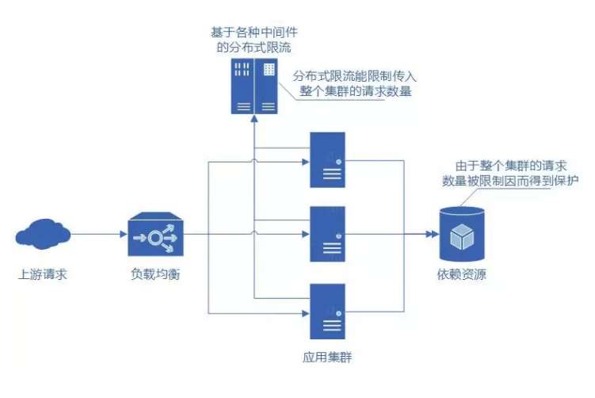

> 微服务拆分之后，系统之间的调用关系错综复杂，平台的整体复杂熵升高，出错的概率、debug 问题的难度都高了好几个数量级。所以，服务治理便成了微服务的一个技术重点。服务治理本身的概念比较大，包括鉴权、限流、降级、熔断、监控告警等等，接下来打算写一系列关于微服务治理的文章来分解以上的治理问题，此文先对于**`限流`**展开介绍。

### 限流的作用

由于 API 接口无法控制调用方的行为，因此当遇到瞬时请求量激增时，会导致接口占用过多服务器资源，使得其他请求响应速度降低或是超时，更有甚者可能导致服务器宕机。

限流主要解决以下几个问题：

- 热点业务带来的突发请求；
- 调用方 bug 导致的突发请求；
- 恶意攻击请求。

除此之外，限流还可以用来解决：

* 慢接口的高并发调用导致的占用服务的线程资源不释放，导致无法响应其他接口请求，从而拖垮整个微服务
* 保证核心业务接口的稳定性，一般来说核心业务都要做非预期异常流量的限流来保证核心业务的稳定性。

### 限流算法

#### 固定、滑动时间窗口限流算法

#### 固定时间窗口算法

基于固定时间窗口的限流算法是非常简单的。首先需要选定一个时间起点，之后每次接口请求到来都累加计数器，如果在当前时间窗口内，根据限流规则（比如每秒钟最大允许 100 次接口请求），累加访问次数超过限流值，则限流熔断拒绝接口请求。当进入下一个时间窗口之后，计数器清零重新计数。

这种基于固定时间窗口的限流算法的缺点在于：限流策略过于粗略，无法应对两个时间窗口临界时间内的突发流量。

例如：限制 1 秒内最多通过 5 个请求，在第一个窗口的最后半秒内通过了 5 个请求，第二个窗口的前半秒内又通过了 5 个请求。这样看来就是在 1 秒内通过了 10 个请求。

#### 滑动时间窗口算法

滑动时间窗口算法是对固定时间窗口算法的一种改进，流量经过滑动时间窗口算法整形之后，可以保证任意时间窗口内，都不会超过最大允许的限流值，从流量曲线上来看会更加平滑，可以部分解决上面提到的临界突发流量问题。对比固定时间窗口限流算法，滑动时间窗口限流算法的时间窗口是持续滑动的，并且除了需要一个计数器来记录时间窗口内接口请求次数之外，还需要记录在时间窗口内每个接口请求到达的时间点，对内存的占用会比较多。滑动时间窗口的算法模型如下：

**Setp1:**  检查接口 A请求的时间是否在当前的时间窗口 [t_start, t_start+1 秒) 内。如果是，则跳转到 Step 3，否则跳转到 Step 2.

**Step2:** 向后滑动时间窗口，将时间窗口的起点 t_start+1 更新为 list 中的第二小时间点，并将最小的时间点从 list 中删除。然后，跳转到 Step 1.

**Step3:**判断当前时间窗口内的接口请求数是否小于最大允许的接口请求限流值，即判断: list.size < max_hits_limit，如果小于，则说明没有超过限流值，允许接口请求，并将此接口请求的访问时间放入到时间窗口内，否则直接执行限流熔断。

> 即便滑动时间窗口限流算法可以保证任意时间窗口内接口请求次数都不会超过最大限流值，但是仍然不能防止在**`更细时间粒度`**上面访问过于集中的问题。

比如上面举的例子，第一个 1s 的时间窗口内 100 次请求都集中在最后 10ms 中，第二个1s的时间窗口内 100 次请求都集中在最开始的 10ms 中。

也就是说，基于时间窗口的限流算法，不管是固定时间窗口还是滑动时间窗口，只能在选定的时间粒度上限流，对选定时间粒度内的更加细粒度的访问频率限制是缺陷。

为了应对上面的问题，对于时间窗口限流算法，还有很多改进版本，比如：

多层次限流，我们可以对同一个接口设置多条限流规则，除了 1 秒不超过 100 次之外，我们还可以设置 100ms 不超过 20 次 (这里需要设置的比 10 次大一些)，两条规则同时限制，流量会更加平滑。

#### 令牌桶、漏桶限流算法

上面我们讲了两种基于时间窗口的限流算法：固定时间窗口和滑动时间窗口算法，两种限流算法都无法应对细时间粒度的突发流量，对流量的整形效果在细时间粒度上不够平滑。

要解决这个问题令牌桶、漏桶应运而生，在某些场景下，这两种算法会优于时间窗口算法成为首选。

#### 令牌桶限流算法

1. 接口限制 t 秒内最大访问次数为 n，则每隔 t/n 秒会放一个 token 到桶中；
2. 桶中最多可以存放 b 个 token，如果 token 到达时令牌桶已经满了，那么这个 token 会被丢弃；
3. 接口请求会先从令牌桶中取 token，拿到 token 则处理接口请求，拿不到 token 则执行限流。

令牌桶算法看似比较复杂，其实用Go实现这个令牌桶还是相对简单的。开一个协程根据timer去放入token，用channel来做桶，select case来做default桶满后的操作。

#### 漏桶限流算法

漏桶算法概念如下：

- 将每个请求视作"水滴"放入"漏桶"进行存储；
- “漏桶"以固定速率向外"漏"出请求来执行如果"漏桶"空了则停止"漏水”；
- 如果"漏桶"满了则多余的"水滴"会被直接丢弃。

漏桶算法多使用队列实现，服务的请求会存到队列中，服务的提供方则按照固定的速率从队列中取出请求并执行，过多的请求则放在队列中排队或直接拒绝。

漏桶算法的缺陷也很明显，当短时间内有大量的突发请求时，即便此时服务器没有任何负载，每个请求也都得在队列中等待一段时间才能被响应。

#### 限流算法小结：

​		所以令牌桶和漏桶算法比较适合阻塞式限流，比如一些后台 job 类的限流，超过了最大访问频率之后，请求并不会被拒绝，而是会被阻塞到有令牌后再继续执行。对于像微服务接口这种对响应时间比较敏感的限流场景，会比较适合选择基于时间窗口的否决式限流算法，其中滑动时间窗口限流算法空间复杂度较高，内存占用会比较多，所以对比来看，尽管固定时间窗口算法处理临界突发流量的能力较差，但实现简单，而简单带来了好的性能和不容易出错，所以固定时间窗口算法也不失是一个好的微服务接口限流算法。

### 单机限流与分布式限流

#### 单机限流

为了提高服务的性能和可用性，微服务都会多实例集群部署，所谓单机限流是指：独立的对集群中的每台实例进行接口限流，比如限制每台实例接口访问的频率为最大 1000 次 / 秒，单机限流一般使用单机限流算法。

单机限流的初衷是防止突发流量压垮服务器，所以比较适合针对并发做限制。以上的四种算法都可以实现单机限流。下面会详细代码进行介绍broccoli里面的ratelimit的实现

#### 分布式限流

所谓的分布式限流是指：提供服务级的限流，限制对微服务集群的访问频率，比如限制 A 调用方每分钟最多请求 1 万次“用户服务”，分布式限流适合做细粒度限流或者访问配额，不同的调用方对不同的接口执行不同的限流规则，所以比较适合针对 hits per second 限流。从防止某调用方过度竞争服务资源来说，分布式限流更加适合。

#### 分布式限流的中心化存储问题

分布式限流算法相较于单机的限流算法，最大的区别就是接口请求计数器需要中心化存储，比如开源限流项目 ratelimiter4j 就是基于 Redis 中心计数器来实现分布式限流算法。

分布式限流算法在引入 Redis 中心计数器这个独立的系统之后，系统的复杂度一下子高了很多，因为要解决一些分布式系统的共性技术问题：

**1. 数据一致性问题**

接口限流过程包含三步操作：

Step 1：“读”当前的接口访问计数 n；

Step 2：”判断”是否限流；

Step 3：“写”接口计数 n+1, if 接口限流验证通过

在并发情况下，这 3 步 CAS 操作 (compare and swap) 存在 race condition（竟态）。在多线程环境下，可以通过线程的加锁或者 concurrent 开发包中的 Atomic 原子对象来实现，在go里面可以通过通过锁，或者更高大上的`atomic` 特性运用无锁队列来解决问题。

在分布式情况下，思路也是类似的，可以通过分布式锁，来保证同一时间段只有一个进程在访问，但是引入分布式锁需要引入新的系统和维护锁的代码，代价较大，为了简单，可以选择另一种思路：借助 Redis 单线程工作模式 +Lua 脚本完美的支持了上述操作的原子性。详细可以参看开源项目 ratelimiter4j.

**2.  超时问题**

对于 Redis 的各种异常情况，我们处理起来并不是很难，catch 住，封装为统一的 exception，向上抛，或者吞掉。但是如果 Redis 访问超时，会严重影响接口的响应时间甚至导致接口响应超时，这个副作用是不能接受的。所以在我们访问 Redis 时需要设置合理的超时时间，一旦超时，判定为限流失效，继续执行接口逻辑。Redis 访问超时时间的设置既不能太大也不能太小，太大可能会影响到接口的响应时间，太小可能会导致太多的限流失效。我们可以通过压测或者线上监控，获取到 Redis 访问时间分布情况，再结合服务接口可以容忍的限流延迟时间，权衡设置一个较合理的超时时间。

**3. 性能问题**

分布式限流算法的性能瓶颈主要在中心计数器 Redis，从开源的 ratelimiter4j 压测数据来看，在没有做 Redis sharding 的情况下，基于单实例 Redis 的分布式限流算法的性能要远远低于基于内存的单机限流算法，基于压测环境，单机限流算法可以达到 200 万 TPS，而分布式限流算法只能做到 5 万 TPS。所以，在应用分布式限流算法时，一定要考量限流算法的性能是否满足应用场景，如果微服务接口的 TPS 已经超过了限流框架本身的 TPS，则限流功能会成为性能瓶颈影响接口本身的性能。

除了 TPS 之外，网络延迟也是一个需要特别考虑的问题，特别是如果中心计数器与限流服务跨机房跨城市部署，之间的网络延迟将会非常大，严重影响微服务接口的响应时间。

#### 分布式限流与微服务的部署架构

**1. 在接入层（api-gateway）集成限流功能**

这种集成方式是在微服务架构下，有 api-gateway 的前提下，最合理的架构模式。如果 api-gateway 是单实例部署，使用单机限流算法即可。如果 api-gateway 是多实例部署，为了做到服务级别的限流就必须使用分布式限流算法。

常用的架构有go-micro+etcd+apisix（插件化限流-漏桶算法实现） APISIX 和 etcd 进行资源 fetch 比做路由匹配

关于更多的APISIX可以查看这里：[apisix-v1.4-中文文档](https://www.bookstack.cn/read/apache-apisix-1.4-zh/8f85c755667b023c.md)

**2. 限流功能封装为 前置gRPC 服务**

当微服务接收到接口请求之后，会先通过限流服务暴露的 RPC 接口来查询接口请求是否超过限流阈值。这种架构模式，需要部署一个限流服务，增加了运维成本。这种部署架构，性能瓶颈会出现在微服务与限流服务之间的 RPC 通信上，即便单机限流算法可以做到 200 万 TPS，但经过 RPC 框架之后，做到 10 万 TPS 的请求限流就已经不错了。

**3. 限流功能集成在微服务系统内**

这种架构模式不需要再独立部署服务，减少了运维成本，但限流代码会跟业务代码有一些耦合，不过，可以将限流功能集成在切面层，尽量跟业务代码解耦。如果做服务级的分布式限流，必须使用分布式限流算法，如果是针对每台微服务实例进行单机限流，使用单机限流算法就可以。

例如broccoli的漏桶算法就是直接运用了uber的ratelimit实现：

[broccoli/ratelimit/token.go](https://github.com/elvisNg/broccoliv2/blob/main/ratelimit/token/token.go)

暂时只做了单机限流嗷～

#### 限流熔断策略

这里所讲的熔断策略，就是当接口达到限流上限之后，如何来处理接口请求的问题。前面也有提到过一些限流熔断策略了，所谓否决式限流就是超过最大允许访问频率之后就拒绝请求，比如返回 HTTP status code 429 等，所谓阻塞式限流就是超过最大允许访问频率之后就排队请求。除此之外，还有其他一些限流熔断策略，比如：记录日志，发送告警，服务降级等等。

同一个系统对于不同的调用方也有可能有不同的限流熔断策略，比如对响应时间敏感的调用方，我们可能采用直接拒绝的熔断策略，对于像后台 job 这样对响应时间不敏感的调用方，我们可能采用阻塞排队处理的熔断策略。

我们再来看下其他熔断策略的一些应用场景：比如限流功能刚刚上线，为了验证限流算法的有效性及其限流规则的合理性，确保不误杀请求，可以先采用日志记录 + 告警的限流熔断策略，通过分析日志判定限流功能正常工作后，再进一步升级为其他限流熔断策略。

不同的熔断策略对于选择限流算法也是有影响的，比如令牌桶和漏桶算法就比较适合阻塞式限流熔断场景，如果是否决式的限流熔断场景就比较适合选择基于时间窗口的限流算法。

#### 限流规则的策略

限流规则包含三个部分：时间粒度，接口粒度，最大限流值。

对于时间粒度的考虑上，要更贴近用户的使用场景：

1. 大促的场景下，时间粒度就没有必要做到毫秒量级，做到秒级别即可，因为对于大促购买商品的情况下，毫秒级别的差别并不大，更多的是秒级别的差别流量涌入。
2. 相反的，对于一些用户接口调用场景是job获取或者task，就必须对于调用方的限流粒度越小越好，越能保证服务本身的稳定性。

除了时间粒度之外，还需要根据不同的限流需求选择不同接口粒度，比如：

1. 限制微服务每个实例接口调用频率

2. 限制微服务集群整体的访问频率

3. 限制某个调用方对某个服务的调用频率

4. 限制某个调用方对某个服务的某个接口的访问频率

5. 限制某服务的某个接口的访问频率

6. 限制某服务的某类接口的访问频率

最大限流值：

一般都会做流量加松弛量的总和，这个需要根据每个服务的压测数据与现实调用量来验证限流最大值，迫近最佳性能，最好能做线上的灰度啦。

### 总结：

限流是微服务治理中不可或缺的一部分，能有效保证服务器的资源不被压爆。

对于不同的用户场景选择不同的流控才是我们要搞清楚的问题，在开源的生态下已经有很多很好很完美的实现了，所以到底怎么做选型，才是我们程序员的必修课。

对于策略的计算也是同时不可或缺的，怎么能替公司剩出一个你的薪资的服务器资源，在现在低廉算力的时代也是必须的。

