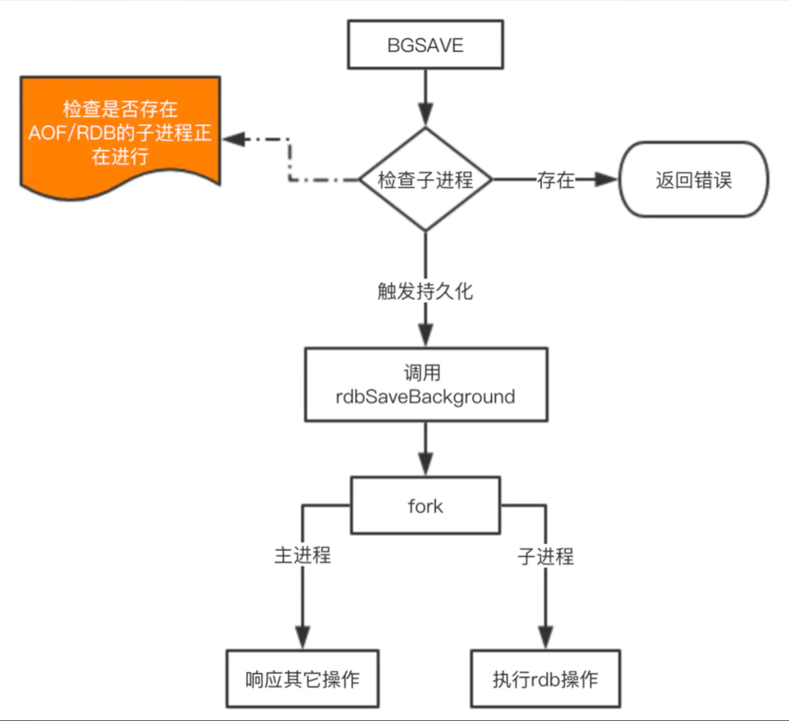
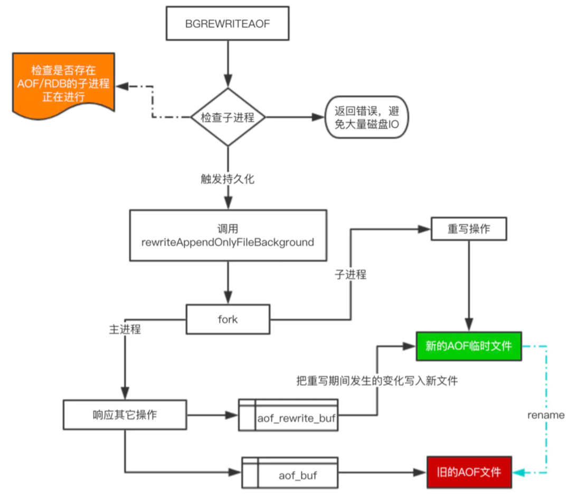
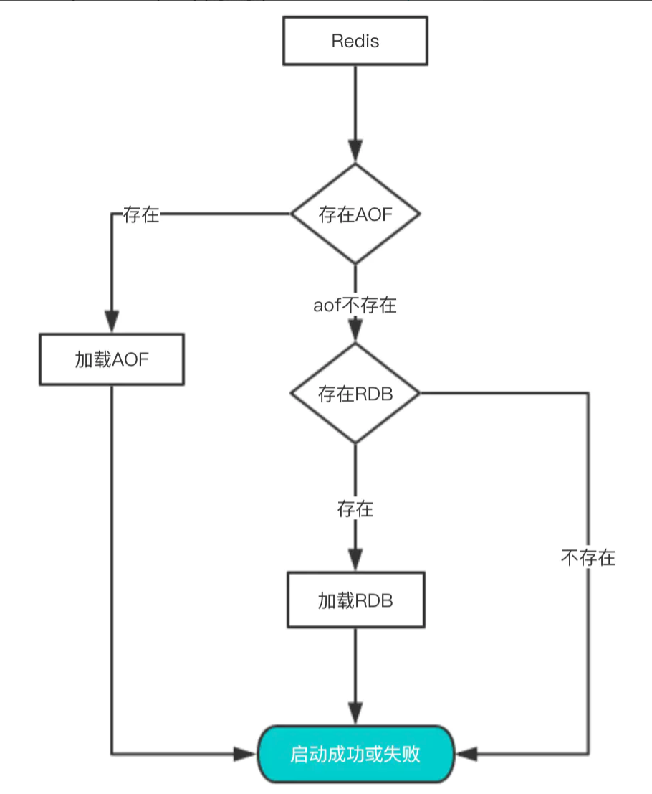

### Redis持久化方式

Redis中支持RDB和AOF这两种持久化机制，目的都是避免因进程退出，造成的数据丢失问题。

**RDB持久化**：把当前进程数据生成时间点快照（point-in-time snapshot）保存到硬盘的过程，避免数据意外丢失。
**AOF持久化**：以独立日志的方式记录每次写命令，重启时在重新执行AOF文件中的命令达到恢复数据的目的。


### 持久化配置

#### RDB配置

```bash
# 时间策略
save 900 1 #表示900s内如果有1条是写入命令，就触发产生一次快照，可以理解为就进行一次备份
save 300 10 # 300s内10条写入命令
save 60 10000 #60秒内10000条写入命令

# 文件名称
dbfilename dump.rdb

# 文件保存路径
dir /home/work/app/redis/data/

# 如果持久化出错，主进程是否停止写入  为了保护持久化的数据一致性问题
stop-writes-on-bgsave-error yes

# 是否压缩  压缩要使用cpu性能，对于单线程的redis来说cpu是资源相对有限的，一般不建议开启
rdbcompression yes

# 导入时是否检查
rdbchecksum yes
```

#### AOF配置

```bash
# 是否开启aof
appendonly yes

# 文件名称
appendfilename "appendonly.aof"

# 同步方式
#always：把每个写命令都立即同步到aof，很慢，但是很安全
#everysec：每秒同步一次，是折中方案
#no：redis不处理交给OS来处理，非常快，但是也最不安全

appendfsync everysec

# aof重写期间是否同步
no-appendfsync-on-rewrite no

# 重写触发配置
auto-aof-rewrite-percentage 100
auto-aof-rewrite-min-size 64mb

# 加载aof时如果有错如何处理 yes为logMark no为中断
aof-load-truncated yes

# 文件重写策略
aof-rewrite-incremental-fsync yes
```


## RDB的原理

在Redis中RDB持久化的触发分为两种：自己手动触发与Redis定时触发。

**针对RDB方式的持久化，手动触发可以使用：**

- save：会阻塞当前Redis服务器，直到持久化完成，线上应该禁止使用。
- bgsave：该触发方式会fork一个子进程，由子进程负责持久化过程，因此阻塞只会发生在fork子进程的时候。

**而自动触发的场景主要是有以下几点：**

- 根据我们的 `save m n` 配置规则自动触发；
- 从节点全量复制时，主节点发送rdb文件给从节点完成复制操作，主节点会触发 `bgsave`；
- 执行 `debug reload` 时；
- 执行  `shutdown`时，如果没有开启aof，也会触发。

由于 `save` 基本不会被使用到，我们重点看看 `bgsave` 这个命令是如何完成RDB的持久化的。




这里注意的是 `fork` 操作会阻塞，导致Redis读写性能下降。我们可以控制单个Redis实例的最大内存，来尽可能降低Redis在fork时的事件消耗。以及上面提到的自动触发的频率减少fork次数，或者使用手动触发，根据自己的机制来完成持久化。

## AOF的原理

AOF的整个流程大体来看可以分为两步，一步是命令的实时写入（如果是 `appendfsync everysec` 配置，会有1s损耗），第二步是对aof文件的重写。

对于增量追加到文件这一步主要的流程是：命令写入=》追加到aof_buf =》同步到aof磁盘。那么这里为什么要先写入buf在同步到磁盘呢？如果实时写入磁盘会带来非常高的磁盘IO，影响整体性能。

aof重写是为了减少aof文件的大小，可以手动或者自动触发，关于自动触发的规则请看上面配置部分。fork的操作也是发生在重写这一步，也是这里会对主进程产生阻塞。

**手动触发：** `bgrewriteaof`，**自动触发** 就是根据配置规则来触发，当然自动触发的整体时间还跟Redis的定时任务频率有关系。

下面来看看重写的一个流程图：



对于上图有四个关键点补充一下：

1. 在重写期间，由于主进程依然在响应命令，为了保证最终备份的完整性；因此它依然会写入旧的AOF file中，如果重写失败，能够保证数据不丢失。
2. 为了把重写期间响应的写入信息也写入到新的文件中，因此也会为子进程保留一个buf，防止新写的file丢失数据。
3. 重写是直接把当前内存的数据生成对应命令，并不需要读取老的AOF文件进行分析、命令合并。
4. AOF文件直接采用的文本协议，主要是兼容性好、追加方便、可读性高可认为修改修复。

> 不能是RDB还是AOF都是先写入一个临时文件，然后通过 `rename` 完成文件的替换工作。

# 从持久化中恢复数据

数据的备份、持久化做完了，我们如何从这些持久化文件中恢复数据呢？如果一台服务器上有既有RDB文件，又有AOF文件，该加载谁呢？

其实想要从这些文件中恢复数据，只需要重新启动Redis即可。我们还是通过图来了解这个流程：




启动时会先检查AOF文件是否存在，如果不存在就尝试加载RDB。那么为什么会优先加载AOF呢？因为AOF保存的数据更完整，通过上面的分析我们知道AOF基本上最多损失1s的数据


#### 频繁执行全量快照的问题

1. 全量数据写入磁盘，磁盘压力大。快照太频繁，前一个任务还未执行完，快照任务之间竞争磁盘带宽，恶性循环
2. fork 操作本身阻塞主线程，主线程内存越大，阻塞时间越长，因为要拷贝内存页表

**解决方法：**全量快照后只做增量快照，但是需要记住修改的数据，下次全量快照时再写入，但这需要在内存中记录修改的数据。因此 Redis 4.0 提出了混合使用 AOF 和全量快照，用 `aof-use-rdb-preamble yes` 设置。这样，两次全量快照间的修改会记录到 AOF 文件

#### **写多读少的场景下，使用 RDB 备份的风险**

1. 内存资源风险：Redis fork子进程做RDB持久化，如果修改命令很多，COW 机制需要重新分配大量内存副本，如果此时父进程又有大量新 key 写入，很快机器内存就会被吃光，如果机器开启了 **Swap 机制**，那么 Redis 会有一部分数据被换到磁盘上，当Redis访问这部分在磁盘上的数据时性能很差。如果机器没有开启Swap，会直接触发OOM，父子进程可能会被系统 kill。
2. CPU资源风险：虽然子进程在做RDB持久化，但**生成RDB快照过程会消耗大量的CPU资源**。可能会与后台进程产生 CPU 竞争，导致父进程处理请求延迟增大，子进程生成RDB快照的时间也会变长，Redis Server 性能下降。
3. **如果 Redis 进程绑定了CPU**，那么子进程会继承父进程的**CPU亲和性**属性，子进程必然会与父进程争夺同一个CPU资源，整个Redis Server 的性能爱将，所以如果 Redis 需要开启定时 RDB 和 AOF 重写，进程一定不要绑定CPU。

