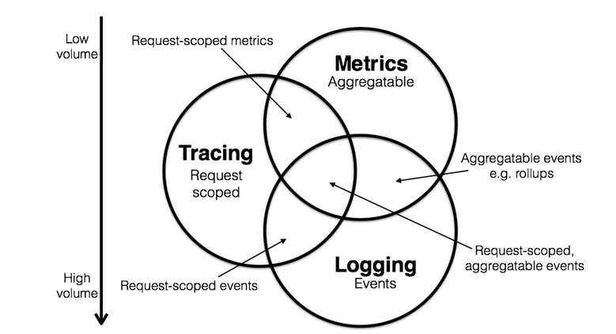
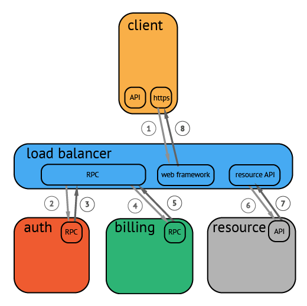
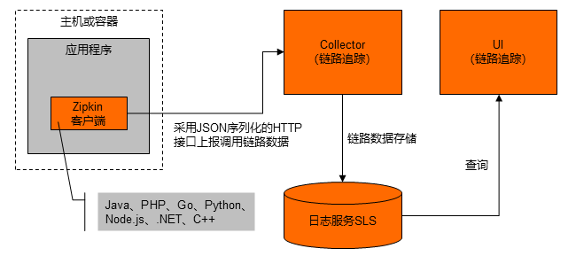

## Logging（ELK），Metrics（Prometheus） 和 Tracing（Zipkin）

Logging，Metrics 和 Tracing 有各自专注的部分。

- Logging - 用于记录离散的事件。例如，应用程序的调试信息或错误信息。它是我们诊断问题的依据。
- Metrics - 用于记录可聚合的数据。例如，队列的当前深度可被定义为一个度量值，在元素入队或出队时被更新；HTTP 请求个数可被定义为一个计数器，新请求到来时进行累加。
- Tracing - 用于记录请求范围内的信息。例如，一次远程方法调用的执行过程和耗时。它是我们排查系统性能问题的利器。
  这三者也有相互重叠的部分，如下图所示。



通过上述信息，我们可以对已有系统进行分类。例如，Zipkin 专注于 tracing 领域；Prometheus 开始专注于 metrics，随着时间推移可能会集成更多的 tracing 功能，但不太可能深入 logging 领域； ELK，阿里云日志服务这样的系统开始专注于 logging 领域，但同时也不断地集成其他领域的特性到系统中来，正向上图中的圆心靠近。

关于三者关系的更详细信息可参考 [Metrics, tracing, and logging](http://peter.bourgon.org/blog/2017/02/21/metrics-tracing-and-logging.html?spm=a2c6h.12873639.0.0.61b453f6uI3VfC)。下面我们重点介绍下 tracing。


## Tracing 的诞生

Tracing 是在90年代就已出现的技术。但真正让该领域流行起来的还是源于 Google 的一篇论文"[Dapper, a Large-Scale Distributed Systems Tracing Infrastructure](https://research.google.com/pubs/pub36356.html?spm=a2c6h.12873639.0.0.61b453f6uI3VfC)"，而另一篇论文"[Uncertainty in Aggregate Estimates from Sampled Distributed Traces](https://research.google.com/pubs/pub40378.html?spm=a2c6h.12873639.0.0.61b453f6uI3VfC)"中则包含关于采样的更详细分析。论文发表后一批优秀的 Tracing 软件孕育而生，比较流行的有：

- Dapper(Google) : 各 tracer 的基础
- StackDriver Trace (Google)
- Zipkin(twitter)
- Appdash(golang)
- 鹰眼(taobao)
- 谛听(盘古，阿里云云产品使用的Trace系统)
- 云图(蚂蚁Trace系统)
- sTrace(神马)
- X-ray(aws)
  分布式追踪系统发展很快，种类繁多，但核心步骤一般有三个：代码埋点，数据存储、查询展示。

## 原理

分布式追踪系统大体分为三个部分，数据采集、数据持久化、数据展示。数据采集是指在代码中埋点，设置请求中要上报的阶段，以及设置当前记录的阶段隶属于哪个上级阶段。数据持久化则是指将上报的数据落盘存储，例如 Jaeger 就支持多种存储后端，可选用 Cassandra 或者 Elasticsearch。数据展示则是前端根据 Trace ID 查询与之关联的请求阶段，并在界面上呈现。



> 图片来源 [Introduction OpenTracing](http://opentracing.io/documentation/)

上图是一个请求的流程例子，请求从客户端发出，到达负载均衡，再依次进行认证、计费，最后取到目标资源。


> 图片来源 [Introduction OpenTracing](http://opentracing.io/documentation/)

请求过程被采集之后，会以上图的形式呈现，横坐标是时间，圆角矩形是请求的执行的各个阶段。


## 数据模型

一个 Tracer 包含了若干个 Span，Span 是追踪链路中的基本组成元素，一个 Span 表示一个独立的工作单元，在链路追踪中可以表示一个接口的调用，一个数据库操作的调用等等。
一个 Span 中包含如下内容：

- 服务名称 (operation name)
- 服务的开始和结束时间
- Tags：k/v 形式
- Logs：k/v 形式
- SpanContext
- Refrences：该 span 对一个或多个 span 的引用（通过引用 SpanContext）

详细说明下上面的字段：

1、Tags
Tags 是一个 K/V 类型的键值对，用户可以自定义该标签并保存。主要用于链路追踪结果对查询过滤。例如：·http.method=”GET”,http.status_code=200。其中 key 值必须为字符串，value 必须是字符串，布尔型或者数值型。span 中的 tag 仅自己可见，不会随着 SpanContext 传递给后续 span

```
span.SetTag("http.method","GET")
span.SetTag("http.status_code",200)
```

2、Logs
Logs 也是一个 K/V 类型的键值对，与 Tags 不同的是，Logs 还会记录写入 Logs 的时间，因此 Logs 主要用于记录某些事件发生的时间。

```
span.LogFields(
	log.String("database","mysql"),
	log.Int("used_time":5),
	log.Int("start_ts":1596335100),
)
```

PS：Opentracing 给出了一些惯用的 Tags 和 Logs，[链接](https://github.com/opentracing/specification/blob/master/semantic_conventions.md)

3、SpanContext（核心字段）
SpanContext 携带着一些用于跨服务通信的（跨进程）数据，主要包含：

- 该 Span 的唯一标识信息，如：`span_id`、`trace_id`
- Baggage Items，为整条追踪连保存跨服务（跨进程）的 K/V 格式的用户自定义数据

4、Baggage Items
Baggage Items 与 Tags 类似，也是 K/V 键值对。与 tags 不同的是：Baggage Items 的 Key 和 Value 都只能是 string 格式，Baggage items 不仅当前 Span 可见，其会随着 SpanContext 传递给后续所有的子 Span。要小心谨慎的使用 Baggage Items：因为在所有的 span 中传递这些 Key/Value 会带来不小的网络和 CPU 开销

5、References（引用关系）
Opentracing 定义了两种引用关系: ChildOf 和 FollowFrom，分别来看：

- ChildOf: 父 Span 的执行依赖子 Span 的执行结果时，此时子 span 对父 span 的引用关系是 ChildOf。比如对于一次 RPC 调用，服务端的 Span（子 Span）与客户端调用的 Span（父 Span）是 ChildOf 关系。
- FollowFrom：父 Span 的执不依赖子 Span 执行结果时，此时子 Span 对父 Span 的引用关系是 FollowFrom。FollowFrom 常用于异步调用的表示，例如消息队列中 Consumerspan 与 Producerspan 之间的关系。

6、Trace
Trace 表示一次完整的追踪链路，trace 由一个或多个 Span 组成。它表示从头到尾的一个请求的调用链，它的标识符是 traceID。 下图示例表示了一个由 8 个 Span 组成的 trace:

```
        [Span A]  ←←←(the root span)
            |
     +------+------+
     |             |
 [Span B]      [Span C] ←←←(Span C is a `ChildOf` Span A)
     |             |
 [Span D]      +---+-------+
               |           |
           [Span E]    [Span F] >>> [Span G] >>> [Span H]
                                       ↑
                                       ↑
                                       ↑
                         (Span G `FollowsFrom` Span F)
```

以时间轴的展现方式如下：

```
––|–––––––|–––––––|–––––––|–––––––|–––––––|–––––––|–––––––|–> time

 [Span A···················································]
   [Span B··············································]
      [Span D··········································]
    [Span C········································]
         [Span E·······]        [Span F··] [Span G··] [Span H··]
```

#### 跟踪上下文

此外，跟踪上下文（Trace Context）也是很重要的场景，它定义了传播跟踪所需的所有信息，例如 traceID，parent-SpanId 等。OpenTracing 提供了两个处理跟踪上下文（Trace Context）的方法：

- `Inject(SpanContext,format,carrier)`：Inject 将跟踪上下文放入媒介，来保证跟踪链的连续性，常用于客户端
- `Extract(format.Carrier)`：一般从媒介（通常是 HTTP 头）获取跟踪上下文，常用于服务端


## ZipKin&Jaeger

### ZipKin-Tracing 的一般流程

Zipkin 是一款开源的分布式实时数据追踪系统（Distributed Tracking System），由 Twitter 公司开发和贡献。其主要功能是聚合来自各个异构系统的实时监控数据。在链路追踪 Tracing Analysis 中，可以通过 Zipkin 上报 Golang 应用数据。

使用 Zipkin 上报数据的流程如下图所示：

使用的 package：

- [openzipkin/zipkin-go](https://github.com/openzipkin/zipkin-go)

下面介绍通过 Zipkin 将 Golang 应用数据上报至链路追踪控制台的方法： 

1、创建 Tracer，Tracer 对象可以用来创建 Span 对象（记录分布式操作时间）。Tracer 对象还配置了上报数据的网关地址、本机 IP、采样频率等数据，您可以通过调整采样率来减少因上报数据产生的开销。

```go
func getTracer(serviceName string, ip string) *zipkin.Tracer {
  // create a reporter to be used by the tracer
  reporter := httpreporter.NewReporter("http://tracing-analysis-dc-hz.aliyuncs.com/adapt_aokcdqnxyz@123456ff_abcdef123@abcdef123/api/v2/spans")
  // set-up the local endpoint for our service
  endpoint, _ := zipkin.NewEndpoint(serviceName, ip)
  // set-up our sampling strategy 设置采样率
  sampler := zipkin.NewModuloSampler(1)
  // initialize the tracer
  tracer, _ := zipkin.NewTracer(
    reporter,
    zipkin.WithLocalEndpoint(endpoint),
    zipkin.WithSampler(sampler),
  )
  return tracer;
}
```

2、记录请求数据，下面代码用于记录请求的根操作：

```go
	// tracer can now be used to create spans.
	span := tracer.StartSpan("some_operation")
	// ... do some work ...
	// span 完成，必须调用 finish
	span.Finish()
	// Output:
```

如果需要记录请求的上一步和下一步操作，则需要传入上下文。如下代码所示，`childSpan` 为 `span` 的孩子节点：

```go
	childSpan := tracer.StartSpan("some_operation2", zipkin.Parent(span.Context()))
		// ... do some work ...
	childSpan.Finish()
```

3、可选：（为了快速定位问题）可以为某个记录添加一些自定义标签（Tags），例如记录是否发生错误、请求的返回值等：

```go
childSpan.Tag("http.status_code", statusCode)
```

4、在分布式系统中发送 RPC 请求时会带上 Tracing 数据，包括 TraceId、ParentSpanId、SpanId、Sampled 等。可以在 HTTP 请求中使用 Extract/Inject 方法在 HTTP Request Headers 上透传数据。即 在 Client 端执行 `Inject`，在 Server 端执行 `Extract`， 目前 Zipkin 已有组件支持以 HTTP、gRPC 这两种 RPC 协议透传 Context 信息。总体数据流程如下：

```go
   Client Span                                                Server Span
┌──────────────────┐                                       ┌──────────────────┐
│                  │                                       │                  │
│   TraceContext   │           Http Request Headers        │   TraceContext   │
│ ┌──────────────┐ │          ┌───────────────────┐        │ ┌──────────────┐ │
│ │ TraceId      │ │          │ X-B3-TraceId      │        │ │ TraceId      │ │
│ │              │ │          │                   │        │ │              │ │
│ │ ParentSpanId │ │ Inject   │ X-B3-ParentSpanId │Extract │ │ ParentSpanId │ │
│ │              ├─┼─────────>│                   ├────────┼>│              │ │
│ │ SpanId       │ │          │ X-B3-SpanId       │        │ │ SpanId       │ │
│ │              │ │          │                   │        │ │              │ │
│ │ Sampled      │ │          │ X-B3-Sampled      │        │ │ Sampled      │ │
│ └──────────────┘ │          └───────────────────┘        │ └──────────────┘ │
│                  │                                       │                  │
└──────────────────┘                                       └──────────────────┘
```

这里以 HTTP 为例，在客户端调用 `Inject` 方法传入 `Context` 信息：

```
req, _ := http.NewRequest("GET", "/", nil)
// configure a function that injects a trace context into a reques
injector := b3.InjectHTTP(req)
injector(sp.Context())
```

在服务端调用 `Extract` 方法解析 `Context` 信息：

```go
req, _ := http.NewRequest("GET", "/", nil)
b3.InjectHTTP(req)(sp.Context())

b.ResetTimer()
_ = b3.ExtractHTTP(copyRequest(req))
```


### Jaeger-Tracing 的一般流程

本小节介绍使用 Jaeger 来实现链路追踪。Jaeger 是 Uber 开源的分布式追踪系统，也是遵循 Opentracing 的系统之一。

1、Jaeger 提供了 all-in-one 镜像，方便我们快速开始测试：

```bash
// 通过 http://localhost:16686 可以打开 Jaeger UI
$ docker run -d --name jaeger \
  -e COLLECTOR_ZIPKIN_HTTP_PORT=9411 \
  -p 5775:5775/udp \
  -p 6831:6831/udp \
  -p 6832:6832/udp \
  -p 5778:5778 \
  -p 16686:16686 \
  -p 14268:14268 \
  -p 9411:9411 \
  jaegertracing/all-in-one:1.14
```

2、初始化 Jaeger tracer，设置 endpoint / 采样率等信息

```go
import (
	"context"
	"errors"
	"fmt"
	"io"
	"time"

	"github.com/opentracing/opentracing-go"
	"github.com/opentracing/opentracing-go/log"
	"github.com/uber/jaeger-client-go"
	jaegercfg "github.com/uber/jaeger-client-go/config"
)
// initJaeger 将 jaeger tracer 设置为全局 tracer
func initJaeger(service string) io.Closer {
	cfg := jaegercfg.Configuration{
		// 将采样频率设置为 1，每一个 span 都记录，方便查看测试结果
		Sampler: &jaegercfg.SamplerConfig{
			Type:  jaeger.SamplerTypeConst,
			Param: 1,
		},
		Reporter: &jaegercfg.ReporterConfig{
			LogSpans: true,
			// 将 span 发往 jaeger-collector 的服务地址
			CollectorEndpoint: "http://localhost:14268/api/traces",
		},
	}
	closer, err := cfg.InitGlobalTracer(service, jaegercfg.Logger(jaeger.StdLogger))
	if err != nil {
		panic(fmt.Sprintf("ERROR: cannot init Jaeger: %v\n", err))
	}
	return closer
}
```

3、创建 tracer，生成 Root Span，下面这段代码创建了一个 Root span，并将该 Span 通过 `context` 传递给 `Foo` 方法，以便在 `Foo` 方法中将追踪链继续延续下去：

```go
func main() {
	closer := initJaeger("in-process")
	defer closer.Close()
	// 获取 jaeger tracer
	t := opentracing.GlobalTracer()
	// 创建 root span
	sp := t.StartSpan("in-process-service")
	// main 执行完结束这个 span
	defer sp.Finish()
	// 将 span 传递给 Foo
	ctx := opentracing.ContextWithSpan(context.Background(), sp)
	Foo(ctx)
}
```

4、`Foo`、`Bar` 方法模拟了独立的子操作 Span，`Foo` 方法调用了 `Bar`，假设在 `Bar` 中发生了一些错误，可以通过 `span.LogFields` 和 `span.SetTag` 将错误记录在追踪链中。`StartSpanFromContext` 这个方法看起来是直接从 `ctx` 中拿到 Span 并继承？

```go
func Foo(ctx context.Context) {
    // 开始一个 span, 设置 span 的 operation_name=Foo
	span, ctx := opentracing.StartSpanFromContext(ctx, "Foo")
	defer span.Finish()
	// 将 context 传递给 Bar
	Bar(ctx)
	// 模拟执行耗时
	time.Sleep(1 * time.Second)
}
func Bar(ctx context.Context) {
    // 开始一个 span，设置 span 的 operation_name=Bar
	span, ctx := opentracing.StartSpanFromContext(ctx, "Bar")
	defer span.Finish()
	// 模拟执行耗时
	time.Sleep(2 * time.Second)

	// 假设 Bar 发生了某些错误
	err := errors.New("something wrong")
	span.LogFields(
		log.String("event", "error"),
		log.String("message", err.Error()),
	)
	span.SetTag("error", true)
}
```

最后，简单看下 `StartSpanFromContext` 的 [实现](https://github.com/opentracing/opentracing-go/blob/master/gocontext.go#L59)，印证了上面的猜想：

```go
func StartSpanFromContextWithTracer(ctx context.Context, tracer Tracer, operationName string, opts ...StartSpanOption) (Span, context.Context) {
	if parentSpan := SpanFromContext(ctx); parentSpan != nil {
		opts = append(opts, ChildOf(parentSpan.Context()))
	}
	span := tracer.StartSpan(operationName, opts...)
	return span, ContextWithSpan(ctx, span)
}
```

小结下上面的过程，如果要确保追踪链在程序中不断开，需要将函数的第一个参数设置为 `context.Context`，通过 `opentracing.ContextWithSpan` 将保存到 context 中，通过 `opentracing.StartSpanFromContext` 开始一个新的子 span，然后设置直到调用流程结束。

假设我们需要在 gRPC 服务中调用另外一个微服务（如 RESTFul 服务），该如何跟踪？简单来说就是使用 HTTP 头作为媒介（Carrier）来传递跟踪信息（traceID）。下一小节，来看下 gRPC 中的 Opentracing 实现。


## gRPC 中的 OpenTracing

本小节，介绍下 gRPC 与 OpenTracing 的结合使用，跟踪一个完整的 RPC 请求，从客户端到服务端的实现。

#### 客户端

客户端的实现如下所示：

```go
const (
    endpoint_url = "http://localhost:9411/api/v1/spans"		//Zipkin-UI 的 URL
    host_url = "localhost:5051"		// 作为标识
    service_name_cache_client = "cache service client"
    service_name_call_get = "callGet"
)

func newTracer () (opentracing.Tracer, zipkintracer.Collector, error) {
	// 创建 HTTP Collector，用来收集跟踪数据并将其发送到 Zipkin-UI
	collector, err := openzipkin.NewHTTPCollector(endpoint_url)
	if err != nil {
		return nil, nil, err
	}
	// 创建了一个记录器 (recorder) 来记录端口上的信息
	recorder :=openzipkin.NewRecorder(collector, true, host_url, service_name_cache_client)

	// 使用记录器 recorder 创建了一个新的跟踪器 (tracer)
	tracer, err := openzipkin.NewTracer(
		recorder,
		openzipkin.ClientServerSameSpan(true))

	if err != nil {
		return nil,nil,err
	}

	// 设置全局 tracer
	opentracing.SetGlobalTracer(tracer)

	return tracer,collector, nil
}


func DoRPCMethods(c pb.HelloServiceClient) ( []byte, error) {
    span := opentracing.StartSpan("RPC-CALL-METHOD-NAME")
    defer span.Finish()
    time.Sleep(5*time.Millisecond)
	// Put root span in context so it will be used in our calls to the client
	// 通过 opentracing.ContextWithSpan 拿到传递的 ctx
    ctx := opentracing.ContextWithSpan(context.Background(), span)
    //ctx := context.Background()
    getReq:=&pb.RPCMethodReq{}
    getResp, err :=RPCMethod(ctx, getReq)
    value := getResp.Value
    return value, err
}

func main(){
	// 初始化 tracer
	tracer, collector, err :=newTracer()
	if err != nil {
		panic(err)
	}
	defer collector.Close()
	// 注意这里使用了拦截器 OpenTracingClientInterceptor
	connection, err := grpc.Dial(host_url,
		grpc.WithInsecure(), grpc.WithUnaryInterceptor(otgrpc.OpenTracingClientInterceptor(tracer, otgrpc.LogPayloads())),
		)
	if err != nil {
		panic(err)
	}
	defer connection.Close()
	client := pb.NewHelloServiceClient(connection)
	err := DoRPCMethods(client)
	......
}
```

#### 服务端实现

下面是服务端代码，同样使用拦截器 `OpenTracingServerInterceptor` 来构建，服务端的 RPC 方法中包含了一次对 Database 的请求。

```go
func main(){
    connection, err := net.Listen(network, host_url)
	if err != nil {
		panic(err)
	}
	tracer,err  := newTracer()
	if err != nil {
		panic(err)
	}
	opts := []grpc.ServerOption{
		grpc.UnaryInterceptor(
			otgrpc.OpenTracingServerInterceptor(tracer,otgrpc.LogPayloads()),
		),
	}
	srv := grpc.NewServer(opts...)
	cs := initCache()
	pb.RegisterCacheServiceServer(srv, cs)

	err = srv.Serve(connection)
	if err != nil {
		panic(err)
	}
}

const service_name_db_query_user = "QueryDatabase"

func (c *HelloService) RPCMethod(ctx context.Context, req *pb.GetReq) (*pb.GetResp, error) {
    if parent := opentracing.SpanFromContext(ctx); parent != nil {
        pctx := parent.Context()
        if tracer := opentracing.GlobalTracer(); tracer != nil {
            mysqlSpan := tracer.StartSpan(service_name_db_query_user, opentracing.ChildOf(pctx))
            defer mysqlSpan.Finish()
            //do some operations
            time.Sleep(time.Millisecond * 10)
        }
    }
    key := req.GetKey()
    value := c.storage[key]
    fmt.Println("get called with return of value:", value)
    resp := &pb.GetResp{Value: value}
    return resp, nil
}
```

前一节，说到跨进程传递 Trace 的时候需要进行的 Inject 和 Extract 操作，上面的示例代码并没有出现。那么客户端 / 服务端如何实现对 Span 的 Inject/Extract 呢？答案就是拦截器 [`otgrpc.OpenTracingServerInterceptor/OpenTracingClientInterceptor` 方法](https://github.com/grpc-ecosystem/grpc-opentracing/tree/master/go/otgrpc)，这里以 `OpenTracingClientInterceptor` 方法为例：

```go
// OpenTracingClientInterceptor returns a grpc.UnaryClientInterceptor suitable
// for use in a grpc.Dial call.
//
// For example:
//
// conn, err := grpc.Dial(
// address,
// ..., // (existing DialOptions)
// grpc.WithUnaryInterceptor(otgrpc.OpenTracingClientInterceptor(tracer)))
//
// All gRPC client spans will inject the OpenTracing SpanContext into the gRPC
// metadata; they will also look in the context.Context for an active
// in-process parent Span and establish a ChildOf reference if such a parent
// Span could be found.
func OpenTracingClientInterceptor(tracer opentracing.Tracer, optFuncs ...Option) grpc.UnaryClientInterceptor {
	otgrpcOpts := newOptions()
	otgrpcOpts.apply(optFuncs...)
	return func(
		ctx context.Context,
		method string,
		req, resp interface{},
		cc *grpc.ClientConn,
		invoker grpc.UnaryInvoker,
		opts ...grpc.CallOption,
	) error {
		var err error
		var parentCtx opentracing.SpanContext
		if parent := opentracing.SpanFromContext(ctx); parent != nil {
			parentCtx = parent.Context()
		}
		if otgrpcOpts.inclusionFunc != nil &&
			!otgrpcOpts.inclusionFunc(parentCtx, method, req, resp) {
			return invoker(ctx, method, req, resp, cc, opts...)
		}
		clientSpan := tracer.StartSpan(
			method,
			opentracing.ChildOf(parentCtx),
			ext.SpanKindRPCClient,
			gRPCComponentTag,
		)
		defer clientSpan.Finish()
		// 调用 injectSpanContext
		ctx = injectSpanContext(ctx, tracer, clientSpan)
		if otgrpcOpts.logPayloads {
			clientSpan.LogFields(log.Object("gRPC request", req))
		}
		err = invoker(ctx, method, req, resp, cc, opts...)
		if err == nil {
			if otgrpcOpts.logPayloads {
				clientSpan.LogFields(log.Object("gRPC response", resp))
			}
		} else {
			SetSpanTags(clientSpan, err, true)
			clientSpan.LogFields(log.String("event", "error"), log.String("message", err.Error()))
		}
		if otgrpcOpts.decorator != nil {
			otgrpcOpts.decorator(clientSpan, method, req, resp, err)
		}
		return err
	}
}

//injectSpanContext 方法
func injectSpanContext(ctx context.Context, tracer opentracing.Tracer, clientSpan opentracing.Span) context.Context {
	md, ok := metadata.FromOutgoingContext(ctx)
	if !ok {
		md = metadata.New(nil)
	} else {
		md = md.Copy()
	}
	mdWriter := metadataReaderWriter{md}
	err := tracer.Inject(clientSpan.Context(), opentracing.HTTPHeaders, mdWriter)
	// We have no better place to record an error than the Span itself :-/
	if err != nil {
		clientSpan.LogFields(log.String("event", "Tracer.Inject() failed"), log.Error(err))
	}
	return metadata.NewOutgoingContext(ctx, md)
}
```

从客户端 `injectSpanContext` 的实现来看，最终在 RPC 调用前，通过 `metadata.NewOutgoingContext` 将 Context 信息（包含了 Tracer），即获取了跟踪上下文并将其注入 HTTP 头，因此我们不需要再次调用 `inject` 函数。而在服务器端，从 HTTP 头中 Extract 跟踪上下文并将其放入 Golang context 中，无须手动调用 Extract 方法。

但对于其他基于 HTTP 的服务（如 RESTFul-API 服务），情况就并非如此，需要写代码从服务器端的 HTTP 头中提取跟踪上下文，亦或也使用拦截器实现，如 Kratos 的 bm 框架的 [Trace 拦截器](https://github.com/go-kratos/kratos/blob/master/pkg/net/http/blademaster/trace.go)


## Zipkin和Jaeger对比

### Zipkin和Jaeger的优势：

#### Zipkin成熟

**Zipkin是更成熟的平台。它拥有广泛的行业支持，拥有庞大而活跃的社区。**Zipkin用Java编写，非常适合企业环境。但是，它也支持大多数流行的高级语言，如果你不知道或不喜欢Java，那么这很好。无论你选择哪种语言，Zipkin都支持[OpenTracing](https://opentracing.io/)，[OpenCensus](https://opencensus.io/)和[OpenTelemetry](https://opentelemetry.io/)（这三大开放跟踪框架），并具有广泛的可扩展性选项和工具集成。

#### Jaeger性能高

**Jaeger**与Zipkin大致相似，但具有一些独特的功能。首先，它**具有更现代的设计和体系结构。其分布更广泛的方法具有高度的灵活性和高性能**。Jaeger为你提供了一个基于Web的UI，你可以轻松地对其进行部署和扩展。

Jaeger社区通过提供良好的文档资料和一系列部署选项来弥补Jaeger相对不成熟的问题。Jaeger还支持[Cloud Native Computing Foundation（CNCF）](https://www.cncf.io/announcements/2019/10/31/cloud-native-computing-foundation-announces-jaeger-graduation/)，尽管这不是标准的建议，但应予以考虑。

### Zipkin和Jaeger的劣势：

#### Zipkin灵活性低

由于Zipkin是两者中的较老者，因此其较旧的设计使用的模块化程度较低，与新的竞争对手相比，它速度更慢且灵活性更低。尽管对于较小的系统，这种差异可能无关紧要，但是随着系统开始增长或需要快速扩展，这可能会成为问题。Zipkin的模块化程度较低的设计缺乏新方法的灵活性，可能会影响其整体性能。

**Zipkin的核心组件是用Java编写的，这对于任何重视稳定性而不是性能的组织都非常有用。**Zipkin提供了支持许多开发语言，但没有对一些流行语言（如Python，Ruby和PHP）进行支持。

#### Jaeger复杂且难以维护

Jaeger可能会更新，但这并不一定意味着它会更好。实际上，许多人（尤其是企业IT部门的人）会将Jaeger的相对不成熟视为劣势。Jaeger选择[Go](https://www.infoworld.com/article/3198928/whats-the-go-language-really-good-for.html)作为主要语言，Go是作为一种系统语言编写的，但是它远没有Java流行。这意味着你可能必须学习一种新的语言，而不是去学习一种已知的语言。

**Jaeger的另一个既是福也是祸的领域是其更现代的设计。这种体系结构在性能，可靠性和可伸缩性方面提供了很多好处，但是它也更加复杂且难以维护。**

### Zipkin或Jaeger：哪一种适合你？

在给出建议之前，我们先总结一下Zipkin和Jaeger的优缺点。在选择时，你还应考虑组织的结构，监视需求以及团队内部的技术专长。此外，你还应该考虑组织和团队是喜欢新颖还是更成熟的技术。

Zipkin和Jaeger都是收集、跟踪分布式系统数据的好选择。它们非常相似，并且都可以胜任。它们都支持分布式跟踪框架（如OpenCensus，OpenTracing和OpenTelemetry)。另外，Zipkin和Jaeger具有广泛的扩展性选项和工具集成，并且都支持虚拟化和容器化。两种工具都依赖于内存存储，并且面临类似的数据丢失问题。

**对于那些重视稳定性的组织，Zipkin是更好的选择。**它更加成熟，拥有越来越大的社区。Zipkin具有广泛的行业支持，其基于Java开发使其适用于目前的IT世界。

**Jaeger虽然缺乏成熟度，但它具有速度快和灵活性高的特点，还有更高的性能，并且更易于扩展。**Jaeger的开发语言支持比Jaeger要好，还支持CNCF。